<!-- ============================================================ -->
<!--         ULTRA-WIDE VENOM ANIMATED HEADER                     -->
<!-- ============================================================ -->


<div align="center">


<div align="center"
<br/>


<br/>


<br/><br/>


&nbsp;

&nbsp;

&nbsp;


<br/><br/>


&nbsp;

&nbsp;

&nbsp;


<br/><br/>


&nbsp;

&nbsp;

&nbsp;


<br/><br/>


&nbsp;

&nbsp;


</div>

<br/>


---

## `$ whoami`

```bash
╔══════════════════════════════════════════════════════════════════════════════╗
║  ██╗     ██╗███████╗███████╗     ██████╗ ██████╗ ██████╗ ███████╗           ║
║  ██║     ██║██╔════╝██╔════╝    ██╔════╝██╔═══██╗██╔══██╗██╔════╝           ║
║  ██║     ██║█████╗  █████╗      ██║     ██║   ██║██║  ██║█████╗             ║
║  ██║     ██║██╔══╝  ██╔══╝      ██║     ██║   ██║██║  ██║██╔══╝             ║
║  ███████╗██║██║     ███████╗    ╚██████╗╚██████╔╝██████╔╝███████╗           ║
║  ╚══════╝╚═╝╚═╝     ╚══════╝     ╚═════╝ ╚═════╝ ╚═════╝ ╚══════╝           ║
╠══════════════════════════════════════════════════════════════════════════════╣
║  NAME       :  IJEOMA JANE OKOJIE                                            ║
║  ORIGIN     :  Nigeria 🇳🇬 — The Giant of Africa                              ║
║  CITY       :  Port Harcourt — Where Code Meets Crude Oil                    ║
║  GITHUB     :  [github.com/NewNexus001](https://github.com/NewNexus001)                                        ║
║  ROLES      :  Lead Systems Architect  ·  AI/ML Engineer                    ║
║               Web3 Protocol Engineer  ·  Ethical Security Specialist         ║
║               Low-Level Systems Eng.  ·  Creative Director                   ║
║               Data Scientist          ·  Motion Artist                       ║
║  PHILOSOPHY :  Proof of understanding. Not proof of mouth.                   ║
║  APPROACH   :  If I claim it, I can build it. From scratch. Today.           ║
║  MISSION    :  Architect ecosystems that outlive every technology trend.      ║
║  CREDO      :  Amateurs write features. Engineers design systems.             ║
║  CREED      :  The measure of an engineer is not the languages they know —   ║
║               it is whether they can sketch a system on a whiteboard,        ║
║               name every single failure mode, and justify every trade-off    ║
║               before a single line of code is written.                       ║
║  SYSTEM     :  [ ████████████████████ ] ALL CYLINDERS FIRING                 ║
╚══════════════════════════════════════════════════════════════════════════════╝
```


---

## 🏛️ Production Architecture — 25 Topologies I Reason In Every Day

<div align="center">


</div>

> *"The measure of a senior engineer is not how many languages they know — it is whether they can sketch a system on a whiteboard, name every failure mode, and justify every trade-off before a single line of code is written."*

---

### ⛓️ Topology 01 — High-Frequency DeFi & Layer-2 ZK-Rollup Infrastructure

**The Problem you run into building DeFi on Ethereum L1** is brutal: 15 transactions per second, gas fees measured in dollars, and every pending transaction sitting in a public mempool where MEV bots see it in real time and front-run it. You are not building a product — you are paying a tax to validators on every single interaction.

**The Engineering Answer:** A ZK-Rollup batches thousands of Layer-2 transactions into a single L1 calldata submission. The Prover cluster generates a SNARK — a mathematical proof that says "all 10,000 of these transactions are cryptographically valid" — without revealing transaction content. Ethereum only verifies the proof on-chain, not re-execute every operation. This drops per-transaction gas cost by over 100×. Flashbots' private relay bypasses the public mempool entirely, eliminating front-running at the source level.

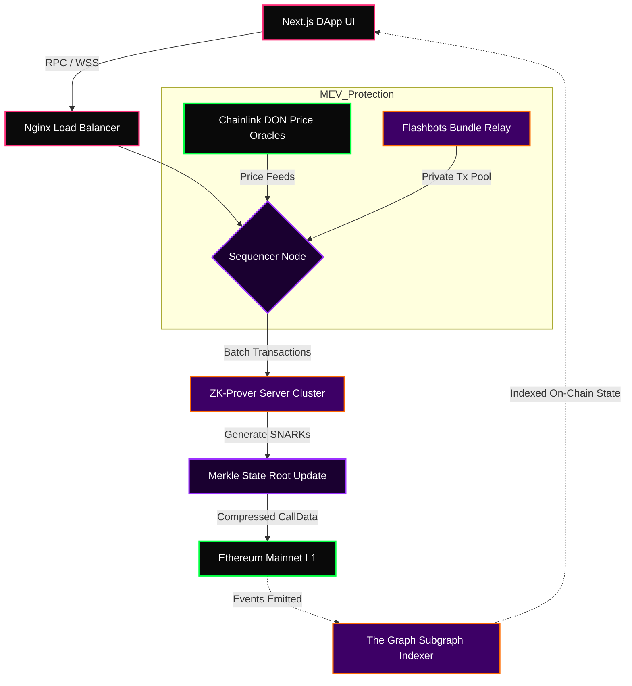

**Why ZK over Optimistic:** An Optimistic Rollup assumes transactions are valid and only runs fraud proofs when challenged — creating a mandatory 7-day withdrawal delay. A ZK-Rollup proves validity *immediately*, enabling near-instant finality. The trade-off is that ZK proving is computationally expensive, which is why the Prover Cluster is a separate horizontally-scalable farm, not an on-chain operation.

---

### 🧠 Topology 02 — Distributed AI / LLM RAG Pipeline

**The Problem** is that every LLM has a context window ceiling. GPT-4 manages roughly 128k tokens; a production codebase has millions. Stuffing everything into the prompt is not a strategy — it is wishful thinking. You hit the limit, pay for tokens you do not need, and the model still hallucinates because it cannot attend uniformly to a 500k-token context.

**The Engineering Answer:** RAG — Retrieval-Augmented Generation — does not feed the model everything. It converts all your data into dense vector embeddings offline, stores them in a vector database, and at inference time fetches only the top-K most semantically relevant chunks using approximate nearest-neighbour search. The model receives a small, high-signal context window and produces accurate, grounded answers.

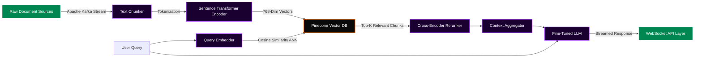

**The Mechanism That Makes It Work:** Semantic similarity is computed via cosine similarity — the dot product of two normalized vectors. A query like "how does staking work?" maps to nearly the same vector space as "describe the validator reward mechanism," even though the exact words differ. This is why vector search beats keyword search: it finds *meaning*, not character strings. The cross-encoder reranker runs a second pass on retrieved chunks and rescores them for query relevance — dramatically improving precision over vector similarity alone.

---

### ⚙️ Topology 03 — Fault-Tolerant Microservices & CQRS Event Sourcing

**The Problem with monoliths** is that they fail together. A memory leak in the payments service takes down the user profile service. A read spike from 50,000 concurrent dashboard loads degrades write performance for order submissions. And when something breaks in production, you are left with a snapshot of the current broken state — no ability to trace what sequence of events caused it.

**The Engineering Answer:** CQRS separates read and write workloads into entirely different services with different scaling profiles. Event Sourcing means the database never stores "the current state" — it stores every event that ever happened as an immutable append-only log. The current state is a *projection* of that event stream. This makes the system fully auditable, replayable from any point in history, and trivially debuggable.

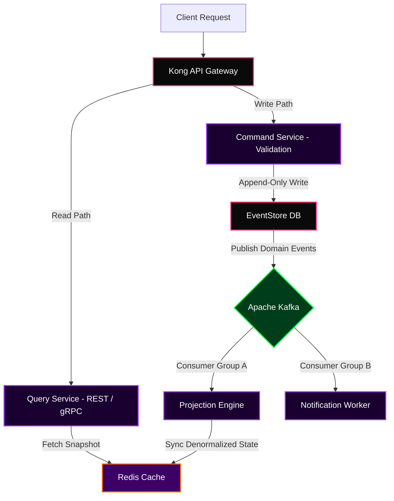

**Why This Is Production-Grade:** A Saga Pattern handles distributed transactions, replacing two-phase commits (which create distributed locks that kill throughput) with a sequence of compensating transactions. Every command carries a unique idempotency key — making it replay-safe. The Kafka stream is partitioned by aggregate ID, guaranteeing ordered delivery per entity without the overhead of total global ordering.

---

### 🔐 Topology 04 — Zero-Trust Network Security Architecture

**The traditional perimeter model** — everything inside the firewall is trusted — is fundamentally broken. Lateral movement is trivially easy once an attacker has one internal foothold. A compromised service can talk to every other service because they share an implicit trust relationship. In a microservices mesh with 50 services, this is catastrophic.

**The Engineering Answer:** Zero-Trust means there is no implicit trust, ever. Every packet, every service, every user must prove identity on every single request — even if they are already inside the network. Every connection uses mutual TLS. Every service authenticates to a central identity provider. Secrets are never stored in environment variables — they are fetched at runtime from a Vault with short-lived, auto-rotated credentials.

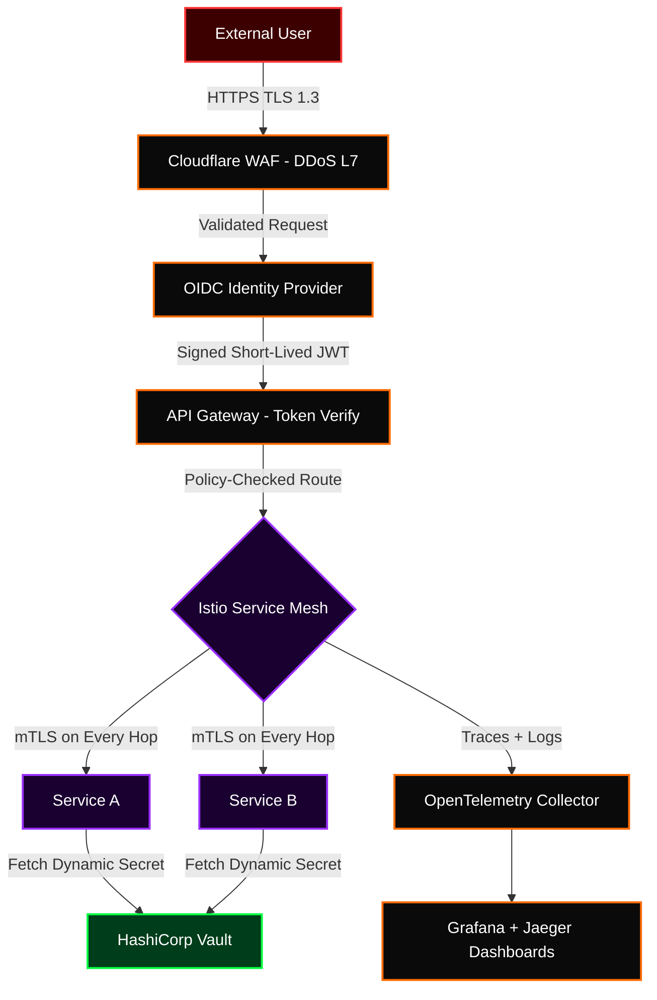

**The Critical Detail:** Istio's Envoy sidecar proxy is injected into every pod in the mesh. It intercepts all traffic, enforces mTLS certificate rotation every 24 hours automatically, and applies `AuthorizationPolicy` rules that define exactly which service can call which endpoint with which HTTP verb. A compromised service cannot reach anything outside its declared policy — lateral movement is stopped at the network layer, not the application layer.

---

### 📊 Topology 05 — Real-Time DEX Order Book Engine

**The Problem with on-chain order matching** is 12-second block times. A Binance spot trade settles in milliseconds. If every order match costs one Ethereum transaction, you have a product only a validator could love. The architecture must bridge this latency gap without sacrificing non-custodial asset guarantees.

**The Engineering Answer:** An off-chain order book with on-chain settlement. Orders are collected and matched off-chain by a high-throughput matching engine capable of millions of matches per second. Only final settled trades go on-chain. User assets remain in a smart contract at all times — the exchange operator can never take custody — but matching happens at CEX speed.

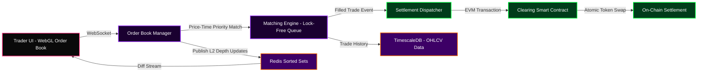

**The Technical Core:** The matching engine uses a price-time priority algorithm on a Red-Black tree data structure. Buy orders stored descending; sell orders ascending. A match fires when best bid >= best ask. The lock-free concurrent queue means multiple CPU cores can process order insertions simultaneously without mutex contention — achieving sub-microsecond match latency in memory before any on-chain settlement is triggered.

---

### 🌉 Topology 06 — Cross-Chain Bridge Protocol

**The Problem** is that each blockchain is an isolated island of state. There is no native way for an Ethereum smart contract to read Solana's state. Cross-chain bridges hold billions in locked value and have been responsible for the largest hacks in all of crypto history: Ronin Bridge ($625M), Wormhole ($320M), Nomad ($190M). The architecture must be secure by mathematical design, not operational promise.

**The Engineering Answer:** A multi-oracle attestation model where no single validator can forge a cross-chain message. Multiple independent oracle nodes observe a lock event on the source chain and independently attest to it. Only when a threshold (2-of-3 or 5-of-9) of distinct ECDSA signatures is collected does the aggregator submit a verified proof to the destination chain for minting.

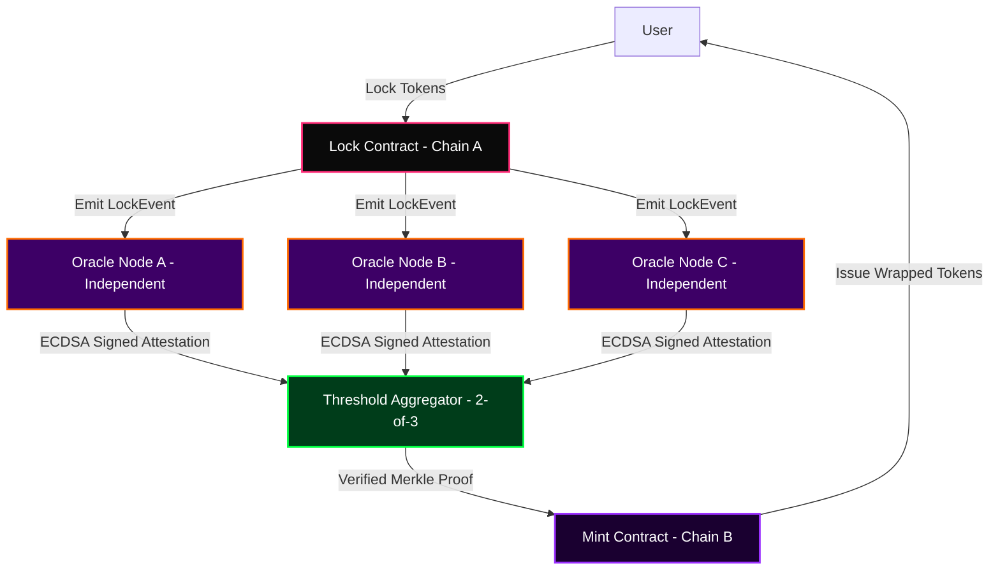

**What Makes a Bridge Secure vs. Insecure:** The Ronin hack succeeded because only 9 validator keys were used and Axie Infinity controlled 5 of them — one attacker owned the threshold. A secure bridge needs a large, *genuinely decentralized* validator set with slashing penalties and hardware-secured key management. The ZK-bridge variant replaces oracle attestation with a validity proof that mathematically proves source chain state — zero trust in validators required.

---

### 🎬 Topology 07 — 8K AI Video Upscaling Pipeline

**Standard bicubic interpolation** averages surrounding pixels. The result is technically higher resolution but visually blurry — it cannot hallucinate detail that was never there. A 1080p source bicubically upscaled to 8K looks worse than native 1080p on a large screen.

**The Engineering Answer:** Real-ESRGAN uses a generator network trained on degradation-paired datasets — real-world 480p inputs paired with clean 4K ground truth. It learns to hallucinate plausible high-frequency detail that matches the statistics of real 8K footage. RIFE adds synthetic frames between existing ones using optical flow, doubling frame rate without duplicating frames.


**The Loss Function That Matters:** The model is trained with a combination of L1 pixel loss (sharpness), perceptual loss via VGG-19 feature maps (perceptual quality), and adversarial loss from a discriminator trained on real 8K footage (realism). MSE loss alone produces blurry output by averaging uncertainty. The adversarial component forces outputs that are statistically indistinguishable from real high-resolution footage, not just numerically close.

---

### 🤝 Topology 08 — Federated Learning with Differential Privacy

**Centralizing all training data** on one server is a legal and ethical problem for healthcare, financial, and personal data. Data that cannot leave a device cannot be centralized. But decentralized data means a model that cannot learn from the full distribution.

**The Engineering Answer:** Federated Learning trains the global model without ever seeing raw client data. Each device trains locally and sends only the *gradient update* — not raw data — to the server. Differential Privacy adds calibrated Gaussian noise to each gradient before uploading, ensuring no individual data point can be reverse-engineered from the gradient, even by an adversarial server.

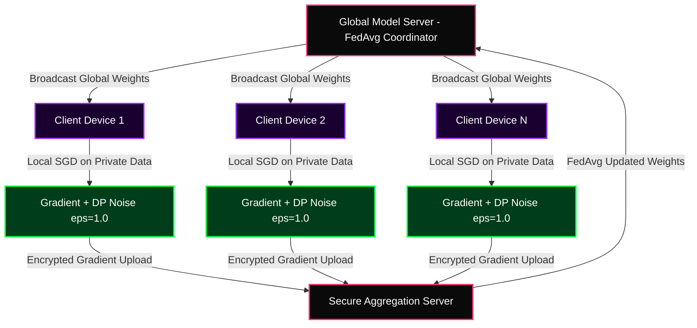

**The Privacy Guarantee:** The (ε, δ)-Differential Privacy guarantee formally bounds how much any individual's data can influence the global model. At ε=1.0, an adversary observing the final model gains at most e¹ ≈ 2.72× advantage in inferring whether any specific record was in the training set — compared to random guessing. This is a mathematical proof, not a policy promise.

---

### ☸️ Topology 09 — Kubernetes Multi-Cluster Federation

**Running a single Kubernetes cluster in one region** is fine until your cloud provider has an outage — and every major cloud provider has had regional outages. You need multi-region active-active deployments where traffic automatically shifts away from failed regions without human intervention.

**The Engineering Answer:** KubeFed (Kubernetes Federation v2) introduces a Cluster Registry and FederatedDeployment CRDs that allow a single control plane to push workloads to multiple clusters simultaneously. Each cluster runs independently, and the federation layer handles propagation, health checking, and spillover scheduling.

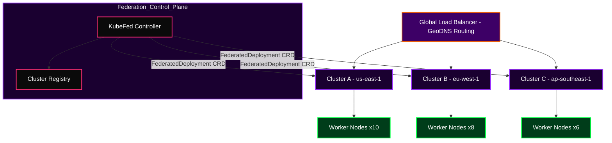

**What Makes This Work at Scale:** Each cluster has its own etcd — there is no shared distributed state between clusters. The federation layer only handles *intent propagation*, not runtime coordination. Cluster Autoscaler in each region independently scales node pools based on pending pod pressure. When one region fails, GeoDNS health checks detect it within 30 seconds and reroutes 100% of traffic to healthy clusters automatically.

---

### 🔗 Topology 10 — GraphQL Federation Gateway

**When you have 20 microservices**, each managing its own domain, asking them all to share a single monolithic GraphQL schema is a coordination nightmare. Every schema change requires a team meeting. Every new field blocks on a gate review. The system stops moving at the speed of the slowest team.

**The Engineering Answer:** Apollo Federation lets each service own its own subgraph schema independently. The Apollo Gateway stitches them into a single unified supergraph at request time, using `@key` directives to resolve entity relationships across service boundaries without coupling the schemas.

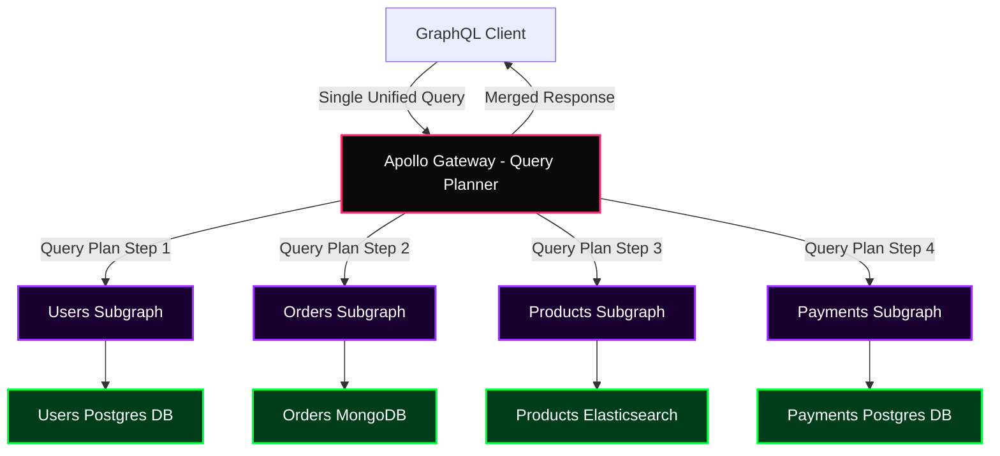

**The Key Mechanism:** The Query Planner analyses the incoming query and generates a parallel execution plan — fetching from multiple subgraphs simultaneously when there are no data dependencies, and sequentially when one subgraph's response is needed as an argument to another. The `@key` directive defines entity primary keys, enabling the gateway to resolve `Order.user` by fetching the `User` entity from the Users subgraph using the `userId` returned from the Orders subgraph.

---

### 🔑 Topology 11 — OAuth2 PKCE + OIDC Authentication Flow

**Most developers implement authentication incorrectly.** They store access tokens in localStorage (vulnerable to XSS), skip PKCE in public clients (vulnerable to authorization code interception), or rely on implicit flow (deprecated for security reasons since RFC 8252). These mistakes are responsible for a significant percentage of account takeovers across the web.

**The Engineering Answer:** The Authorization Code Flow with PKCE (Proof Key for Code Exchange) generates a cryptographic `code_verifier` on the client before the auth request begins. The `code_challenge` (SHA256 hash of the verifier) is sent with the authorization request. The verifier is sent with the token exchange. Even if an attacker intercepts the authorization code, they cannot exchange it without the verifier they never saw.

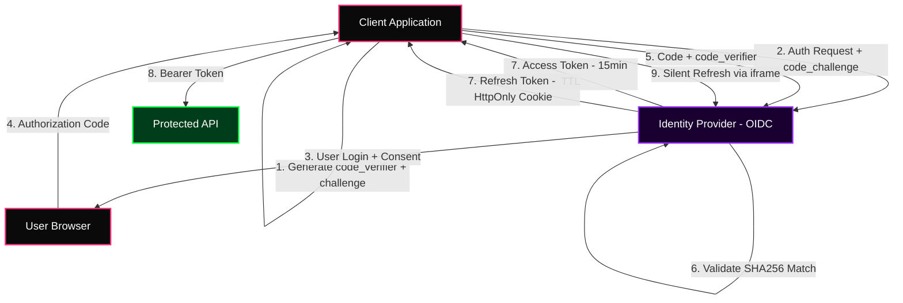

**Why Refresh Token Rotation Matters:** When a refresh token is used, the server immediately issues a new refresh token and invalidates the old one. If an attacker steals a refresh token and uses it, the legitimate client's next silent refresh will fail — triggering an automatic logout and security alert. This converts token theft from a permanent compromise into a detectable, bounded-duration incident.

---

### 🗄️ Topology 12 — Multi-Region Active-Active PostgreSQL

**Single-region Postgres** is a single point of failure for every query. Multi-region read replicas solve read latency but write traffic still funnels through one primary — which means write throughput is limited by one machine and one region's network latency.

**The Engineering Answer:** Citus extends Postgres with distributed sharding. Each table is sharded by a distribution column (e.g., `tenant_id`) using consistent hashing. Write traffic is distributed across coordinator + worker nodes. Logical replication syncs changes to a standby cluster in a second region with sub-second lag. Patroni handles automatic failover using etcd consensus.

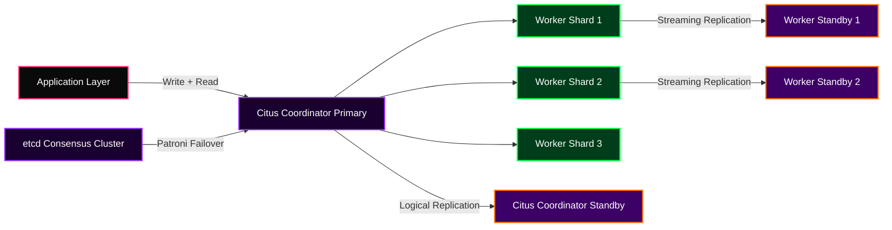

**The Sharding Key Decision Is Everything:** Choosing the wrong distribution column creates hot shards — one worker node handling 80% of traffic while the others idle. The correct key has high cardinality and maps closely to the natural query pattern. For a multi-tenant SaaS, `tenant_id` is almost always correct. For a social network, user-based sharding risks celebrity fan-out problems unless combined with a read-fan-out strategy at the application layer.

---

### 🤖 Topology 13 — MLOps End-to-End Production Pipeline

**The gap between a Jupyter notebook and a production ML system** is not a few hours of cleanup — it is an entirely different engineering discipline. A model that achieves 94% accuracy in a notebook and degrades to 71% in production six months later because nobody set up data drift monitoring is not a machine learning failure. It is an MLOps failure.

**The Engineering Answer:** A complete MLOps pipeline manages the entire model lifecycle: feature engineering, training, evaluation, serving, monitoring, and retraining. The feature store ensures training and serving features are computed identically, eliminating training-serving skew. The model registry tracks versions, metrics, and deployment history.

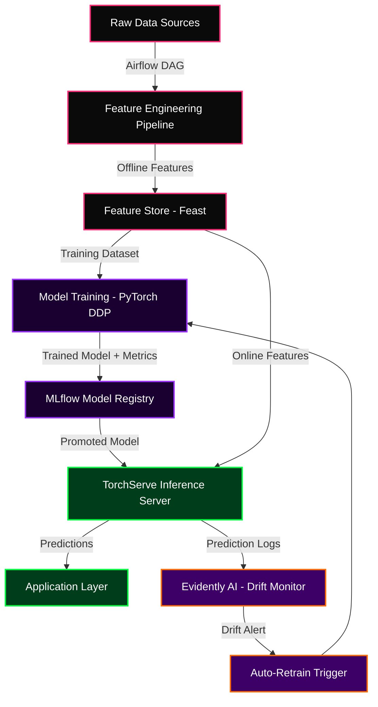

**Training-Serving Skew Is The Silent Killer:** If the feature pipeline running in Airflow at training time uses a 30-day rolling average, but the feature server at inference time uses a 7-day rolling average because someone "optimized" the online computation, your model is receiving inputs it was never trained on. The feature store solves this by maintaining a single feature definition that is computed consistently in both batch (offline) and real-time (online) contexts.

---

### 📡 Topology 14 — WebRTC Peer-to-Peer Media Architecture

**The naive approach to real-time video calls** routes all video through a central media server, which adds 200-400ms of latency, creates a single point of failure, and forces you to pay for every byte of video traffic your users generate — even when they are 5 meters apart.

**The Engineering Answer:** WebRTC establishes direct peer-to-peer connections using ICE (Interactive Connectivity Establishment). STUN servers discover public IP addresses; TURN servers relay traffic when direct connection fails (symmetric NAT). For group calls beyond 4 participants, an SFU (Selective Forwarding Unit) receives each participant's stream once and forwards it to all others — without decoding and re-encoding.

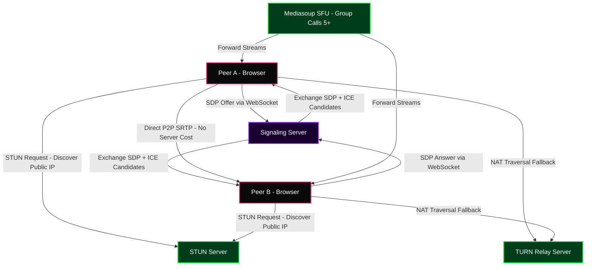

**SFU vs. MCU vs. Mesh:** A pure mesh (every peer connects to every other peer) works for 2-4 participants but upload bandwidth scales as O(n-1). An MCU decodes, mixes, and re-encodes all streams into one composite — CPU-expensive and high-latency. An SFU is the engineering sweet spot: each participant uploads once, the SFU forwards at the RTP packet level (no decode/re-encode), and each client chooses which streams to subscribe to — enabling simulcast quality adaptation.

---

### 🖼️ Topology 15 — NFT Marketplace Smart Contract Architecture

**Most NFT marketplace contracts are deployed and immediately exploitable** because developers use OpenZeppelin templates without understanding the mechanics they are deploying. Reentrancy in royalty payment logic. Storage collisions in upgradeable proxy patterns. Gas griefing in ERC-721 batch mints. These are not theoretical vulnerabilities — they have drained real funds.

**The Engineering Answer:** ERC-721A (Azuki's optimized standard) amortizes the SSTORE cost of sequential mints across a batch. Lazy minting defers on-chain token creation until first transfer, shifting gas costs to buyers. EIP-2981 standardizes royalty information on-chain, enabling any marketplace to query and honor royalties without off-chain agreements.

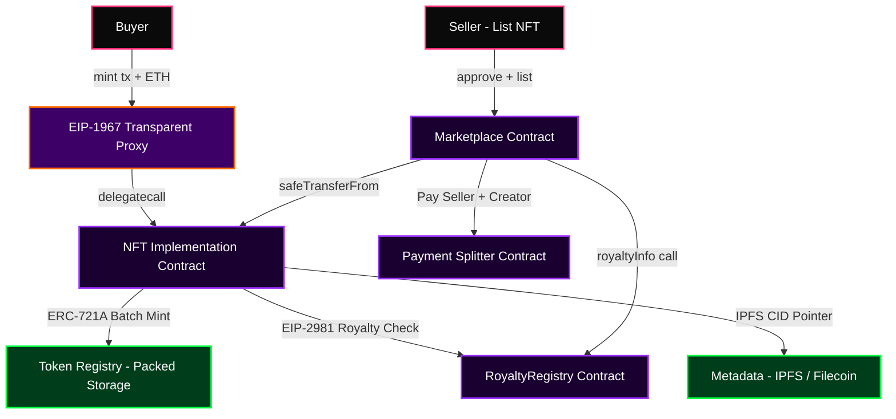

**ERC-721A Storage Packing Explained:** Standard ERC-721 writes two separate storage slots per token minted — `_owners[tokenId]` and `_balances[owner]`. ERC-721A packs consecutive token ownership into a single slot, only writing ownership data at the *start* of a consecutive range. Minting 100 tokens in one transaction requires 1 SSTORE instead of 200, saving approximately 3.8M gas on a 100-token batch mint — roughly $380 at 20 gwei, $3,800 during gas spikes.

---

### 🏛️ Topology 16 — DAO On-Chain Governance System

**Centralized protocol governance is a contradiction in terms.** If one team can upgrade a "decentralized" protocol without token holder approval, it is not decentralized — it is a company with a token. The governance architecture must make protocol changes impossible without legitimate on-chain consent from a quorum of token holders, while still protecting against governance attacks.

**The Engineering Answer:** OpenZeppelin Governor contracts implement a full governance lifecycle: proposal submission, voting period, timelock delay, and execution. The timelock is not optional — it gives token holders time to exit positions before a malicious or contentious upgrade takes effect. Quadratic voting weights square-root the token balance, reducing plutocracy by giving smaller holders proportionally more influence.

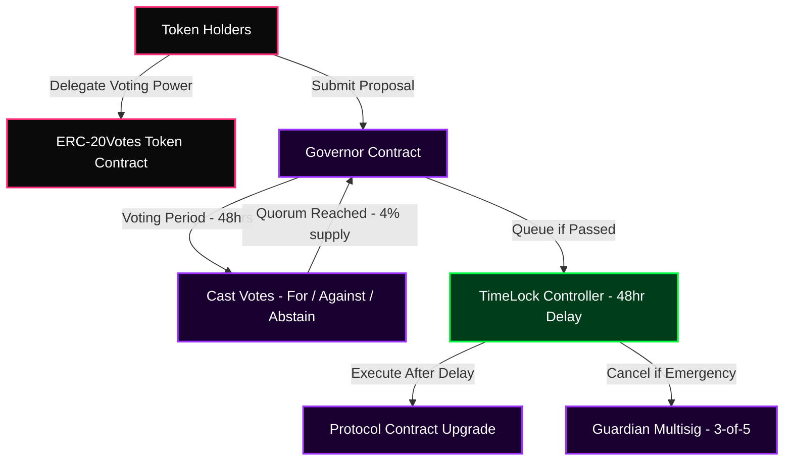

**The Governance Attack Surface:** A flash loan governance attack borrows a massive token position, votes on a malicious proposal in a single transaction, and repays the loan. Defences include: snapshot voting (votes counted at proposal creation block, not vote cast time), minimum proposer threshold, and quorum requirements that exceed what any flash loan can reasonably borrow. The timelock is the final defence — even if an attack succeeds at the vote level, a 48-hour delay gives the community time to notice and the guardian multisig time to cancel.

---

### 💰 Topology 17 — DeFi Yield Aggregator Protocol

**The DeFi landscape has 200+ yield opportunities** across lending protocols, DEX liquidity pools, liquid staking derivatives, and delta-neutral farms. A user manually chasing yield is a full-time job. An automated yield aggregator programmatically monitors, shifts, and compounds positions to maximize risk-adjusted returns.

**The Engineering Answer:** A Vault contract (ERC-4626 standard) accepts a single base asset and manages an underlying portfolio of strategy contracts. Each strategy is an independent contract implementing a common interface: `deposit()`, `withdraw()`, `harvest()`, `estimatedTotalAssets()`. The strategist bot runs off-chain optimization, calling `harvest()` to compound rewards and periodically rebalancing across strategies based on net APY after gas costs.

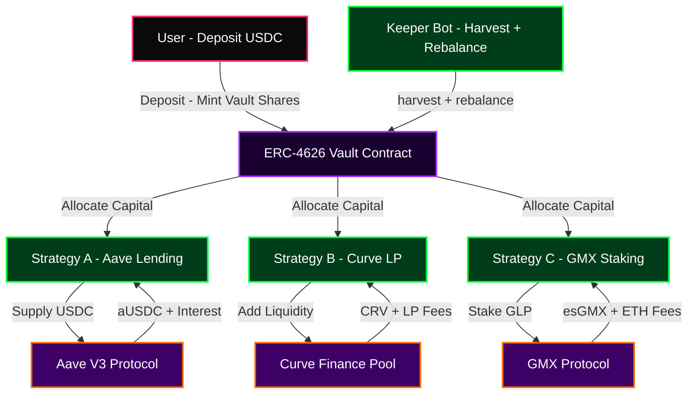

**The Gas Optimization That Makes Harvesting Profitable:** Compounding yield on-chain costs gas. If you harvest daily on a $10,000 position at 10% APY and each harvest costs $15 in gas, you are spending $5,475/year to earn $1,000/year. The vault socializes gas costs across all depositors — one harvest transaction benefits thousands of users simultaneously. The keeper bot only triggers a harvest when `harvestProfit > harvestCost * profitFactor`, ensuring each compound operation is net positive.

---

### 🔮 Topology 18 — Decentralized Oracle Network (Chainlink OCR)

**Smart contracts are deterministic machines with no internet access.** A contract cannot call an API. It cannot read a stock price. It cannot know what the weather is. Every piece of external data a contract needs must be injected on-chain by an oracle — which means oracle manipulation is one of the most common DeFi exploit vectors. Dozens of protocols have lost millions to price oracle attacks.

**The Engineering Answer:** Chainlink's Off-Chain Reporting (OCR) protocol has oracle nodes communicate off-chain to aggregate observations, then submit a single aggregated report signed by a threshold of node keys. This reduces on-chain transactions from N (one per node) to 1 (one aggregated report), cutting gas costs by over 90% while maintaining the security of a decentralized multi-node system.

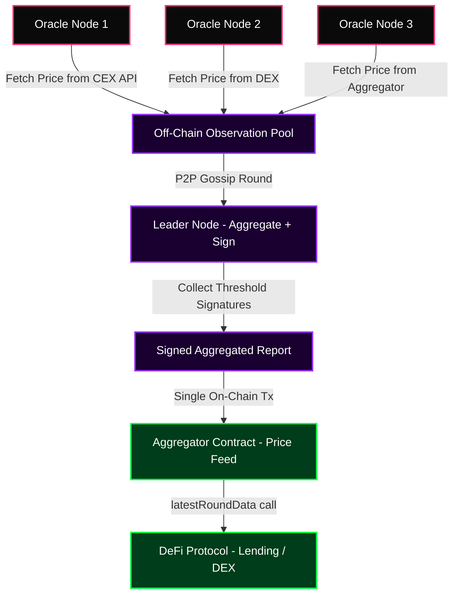

**Why A Median Aggregate Defeats Price Manipulation:** If 21 oracles report a price, an attacker must compromise or manipulate more than half of them to move the median. Manipulating one exchange (to affect 1-2 sources) barely moves the aggregate. The deviation threshold only triggers an on-chain update when the off-chain median has moved more than 0.5% from the last on-chain value — eliminating trivial gas-wasting micro-updates while keeping on-chain data fresh.

---

### 🌐 Topology 19 — Multi-Layer CDN & Edge Architecture

**Serving every request from an origin server** in one region means every user in Lagos, Manila, or São Paulo waits for a round trip to a US data center — adding 200-400ms of latency to every page load. At scale, this is not just a user experience problem. It is a server capacity problem, because the origin handles every byte of traffic directly.

**The Engineering Answer:** A multi-layer CDN uses an origin shield — a designated middle-tier cluster that acts as a consolidated cache for all CDN edge PoPs. Instead of 500 edge nodes each independently making cache miss requests to the origin, they all cache-miss to the shield, which makes one request to the origin. This reduces origin traffic by 95%+ during cache misses.

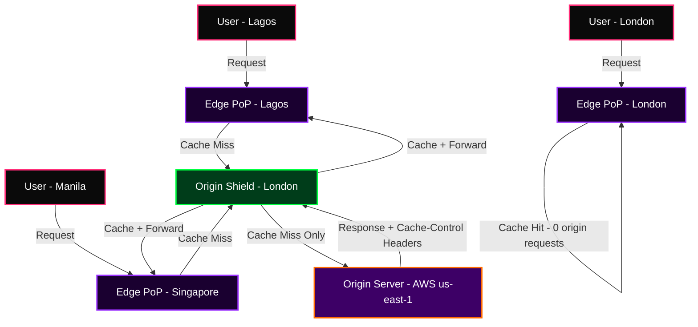

**Cache-Control Strategy Is The Actual Engineering Work:** Setting `max-age=31536000, immutable` on static assets with content-hash filenames means those assets never cause an origin request after first load — they live at the edge permanently. Dynamic API responses use `stale-while-revalidate` — the edge serves the cached response instantly and kicks off a background revalidation, delivering both speed and freshness. The art is knowing which TTL to apply to which resource class.

---

### 📡 Topology 20 — Full Observability Stack (Logs + Metrics + Traces)

**A system you cannot observe cannot be debugged.** Logs without correlation IDs tell you what happened on one service but not why. Metrics without traces tell you the 99th percentile latency is high but not which service in a 15-hop request chain is responsible. Traces without logs give you the skeleton of a request but not the flesh.

**The Engineering Answer:** The three pillars of observability — logs, metrics, and traces — must be correlated by a shared trace context. OpenTelemetry is the vendor-neutral instrumentation layer that propagates `trace_id` and `span_id` through every service call, allowing you to jump from a slow P99 latency metric directly to the distributed trace that explains it, and from the trace to the logs emitted during that specific span.

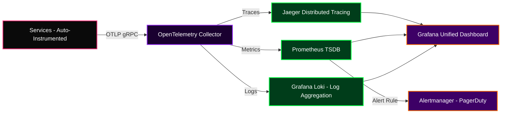

**The Exemplar Is The Missing Link:** Prometheus 2.x introduced exemplar support — the ability to embed a `trace_id` directly inside a metric sample. When you see a latency spike on a Grafana dashboard, you click the data point, and if an exemplar is attached, it hyperlinks directly to the Jaeger trace for that specific slow request. This is the difference between "P99 latency spiked at 14:32" and "here is the exact request that was slow and here is every service it touched."

---

### 💾 Topology 21 — Systems-Level Memory Allocator (Slab + Buddy System)

**The default `malloc` implementation** in glibc is a general-purpose allocator designed to work reasonably well for all allocation patterns. But in a high-frequency system — a web server handling 100,000 RPS, a game engine allocating 10,000 particles per frame — the overhead of lock contention on the global heap, fragmentation, and cache-unfriendly allocation patterns becomes measurable in milliseconds.

**The Engineering Answer:** A slab allocator pre-allocates fixed-size memory slabs for objects of specific sizes (64-byte, 128-byte, 256-byte classes). Allocation for a known-size object becomes O(1) — pop an object from the free list. The buddy system manages variable-size allocations by recursively splitting power-of-2 blocks, enabling O(log n) coalescing of free adjacent blocks.

```mermaid
graph TD
    classDef alloc fill:#0a0a0a,stroke:#FF2D78,stroke-width:2px,color:#fff
    classDef slab fill:#1a0030,stroke:#9B30FF,stroke-width:2px,color:#fff
    classDef buddy fill:#003d1a,stroke:#00FF41,stroke-width:2px,color:#fff
    classDef os fill:#3d0066,stroke:#FF6B00,stroke-width:2px,color:#fff

    APP["Application malloc() Call"]:::alloc -->|Size <= 512 bytes| SLAB["Slab Allocator"]:::slab
    APP -->|Size > 512 bytes| BUDDY["Buddy System Allocator"]:::buddy
    SLAB -->|Size Class Lookup| S64["64-byte Slab Cache"]:::slab
    SLAB -->|Size Class Lookup| S128["128-byte Slab Cache"]:::slab
    SLAB -->|Size Class Lookup| S256["256-byte Slab Cache"]:::slab
    BUDDY -->|Split Power-of-2 Block| BK1["Block - 512 bytes"]:::buddy
    BK1 -->|Split if needed| BK2["Block - 256 bytes x2"]:::buddy
    S64 -->|Slab Exhausted| OS["mmap syscall - OS Page Allocator"]:::os
    BUDDY -->|Large Alloc| OS
```

**Why Cache Locality Determines Performance:** When a slab allocator returns an object from a recently-freed slot, that memory is still hot in L1/L2 cache. A general-purpose allocator might return memory from a completely different cache line. The Linux kernel uses SLUB (a modernized slab allocator) for exactly this reason — kernel object allocation is so frequent that saving 20ns per allocation across millions of operations per second is worth the implementation complexity.

---

### ⚡ Topology 22 — EVM Execution Engine Internals

**Solidity is not what actually runs on Ethereum.** It is compiled to EVM bytecode — a sequence of single-byte opcodes executed by a stack-based virtual machine with strict gas metering for every instruction. Understanding the EVM at the opcode level is what separates engineers who write smart contracts from engineers who write *optimal* smart contracts.

**The Engineering Answer:** The EVM is a stack machine with a 1024-element stack. Every operation (ADD, MLOAD, SSTORE) pops arguments from the stack and pushes results back. Gas is metered per-opcode: SSTORE (write cold storage) costs 20,000 gas; ADD costs 3 gas. The entire security model of Ethereum depends on gas pricing making infinite loops economically infeasible.

```mermaid
graph TD
    classDef compile fill:#0a0a0a,stroke:#FF2D78,stroke-width:2px,color:#fff
    classDef evm fill:#1a0030,stroke:#9B30FF,stroke-width:2px,color:#fff
    classDef storage fill:#003d1a,stroke:#00FF41,stroke-width:2px,color:#fff

    SOL["Solidity Source Code"]:::compile -->|solc compiler| ABI["ABI + Bytecode"]:::compile
    ABI -->|Deploy Transaction| EVM["EVM Execution Context"]:::evm
    EVM -->|Program Counter| OPCODES["Opcode Dispatcher"]:::evm
    OPCODES -->|PUSH MLOAD ADD| STACK["Execution Stack - 1024 depth"]:::evm
    OPCODES -->|MSTORE MLOAD| MEM["Memory - Linear Byte Array"]:::evm
    OPCODES -->|SSTORE SLOAD| STOR["Storage - 2^256 Key-Value Map"]:::storage
    OPCODES -->|CALL DELEGATECALL| EXT["External Contract Call"]:::evm
    EVM -->|Gas Counter| GAS["Gas Meter - Halt if 0"]:::evm
    EVM -->|RETURN REVERT| RESULT["Execution Result - State Update"]:::evm
```

**DELEGATECALL Is Both The Power and The Danger:** When Contract A calls Contract B with `delegatecall`, Contract B's code runs in Contract A's storage context. This is how upgradeable proxies work — the proxy holds the storage, and the logic contract provides the code. But this means a storage collision between the proxy's admin slot and the implementation contract's variables can silently corrupt state. EIP-1967 standardizes storage slots to specific high-entropy positions that no Solidity variable would naturally occupy — eliminating collisions by convention.

---

### 🌪️ Topology 23 — Chaos Engineering Framework

**Every system fails.** The question is not whether your infrastructure can fail — it is whether you discover the failure modes in a controlled chaos experiment during business hours or in a 3am production incident. Netflix invented Chaos Monkey for exactly this reason: regularly and deliberately killing random production instances to verify that the system's fault tolerance actually works, not just theoretically works.

**The Engineering Answer:** A chaos engineering framework implements the scientific method on infrastructure. Define a steady-state hypothesis (e.g., P99 latency < 200ms, error rate < 0.1%). Introduce a controlled perturbation (kill 1 of 3 API server replicas). Measure whether the steady state holds. If it does, confidence increases. If it breaks, you found a real gap in fault tolerance — in a controlled experiment, not during a real incident.

```mermaid
graph LR
    classDef plan fill:#0a0a0a,stroke:#FF2D78,stroke-width:2px,color:#fff
    classDef inject fill:#1a0030,stroke:#9B30FF,stroke-width:2px,color:#fff
    classDef observe fill:#003d1a,stroke:#00FF41,stroke-width:2px,color:#fff
    classDef learn fill:#3d0066,stroke:#FF6B00,stroke-width:2px,color:#fff

    HYP["Define Steady-State Hypothesis"]:::plan -->|Baseline Metrics| CHAOS["Chaos Experiment Runner"]:::inject
    CHAOS -->|Kill Pod - CPU Spike| INFRA["Target Infrastructure"]:::inject
    CHAOS -->|Network Partition - Latency Inject| INFRA
    CHAOS -->|Memory Pressure - Disk Fill| INFRA
    INFRA -->|Real-Time Telemetry| OBS["Prometheus + Grafana Monitor"]:::observe
    OBS -->|Steady State Holds?| CHECK{"Circuit Breaker Check"}:::observe
    CHECK -->|Yes - Expand Blast Radius| CHAOS
    CHECK -->|No - Auto-Rollback| ROLLBACK["Incident Report + Fix"]:::learn
    ROLLBACK -->|Updated Architecture| HYP
```

**The Game Day Ritual:** Beyond automated chaos experiments, mature engineering teams run structured "Game Days" — scheduled multi-hour events where the chaos engineering team runs pre-planned failure scenarios against production (or a production-identical staging environment) while the on-call team responds as if it were a real incident. The after-action review produces concrete architectural improvements. AWS calls this "Operational Readiness Reviews." Google calls it "DiRT" (Disaster Recovery Testing). Both are mandatory before launching high-criticality services.

---

### 🚀 Topology 24 — GitOps CI/CD Pipeline with Progressive Delivery

**Traditional CI/CD pipelines are pull-based from the deployment side** — a human or a script pushes deployment commands to a cluster. GitOps inverts this: the cluster pulls its desired state from a Git repository. The Git repository becomes the single source of truth for what should be running in every environment, at every moment.

**The Engineering Answer:** ArgoCD watches a Helm chart repository for changes. When a new version is committed (typically triggered by a passing CI pipeline), ArgoCD detects the drift between the declared desired state and the actual cluster state and reconciles. Flagger handles progressive delivery — automatically shifting traffic from old to new deployment in increments (canary analysis) and rolling back if error rate or latency exceeds defined thresholds.

```mermaid
graph TD
    classDef dev fill:#0a0a0a,stroke:#FF2D78,stroke-width:2px,color:#fff
    classDef ci fill:#1a0030,stroke:#9B30FF,stroke-width:2px,color:#fff
    classDef gitops fill:#003d1a,stroke:#00FF41,stroke-width:2px,color:#fff
    classDef cluster fill:#3d0066,stroke:#FF6B00,stroke-width:2px,color:#fff

    DEV["Developer Push - Feature Branch"]:::dev -->|PR + Review| MAIN["Main Branch Merge"]:::dev
    MAIN -->|Webhook Trigger| CI["GitHub Actions - CI Pipeline"]:::ci
    CI -->|Unit + Integration Tests| TEST["Test Suite - Coverage Gate"]:::ci
    TEST -->|Docker Build + Push| REGISTRY["Container Registry"]:::ci
    REGISTRY -->|Helm Chart Update| GIT_OPS["GitOps Manifests Repo"]:::gitops
    GIT_OPS -->|ArgoCD Sync| ARGO["ArgoCD Controller"]:::gitops
    ARGO -->|Detect Drift + Apply| CLUSTER["Kubernetes Cluster"]:::cluster
    CLUSTER -->|New Pods Deployed| FLAGGER["Flagger - Canary Analysis"]:::cluster
    FLAGGER -->|10% Traffic Shift| CANARY["Canary Deployment"]:::cluster
    FLAGGER -->|Metrics OK - Increment to 100%| PROD["Full Production Rollout"]:::cluster
    FLAGGER -->|Metrics Breach - Auto Rollback| CANARY
```

**Deployment Gates Prevent Human Error:** Before any deployment shifts more than 50% of traffic, automated gates check error rate (< 1%), P99 latency (< 200ms), and business-critical metrics like checkout conversion rate (> baseline - 2%). An engineer cannot bypass these gates by clicking "deploy anyway" — the system physically cannot proceed until every gate passes. This makes the CI/CD pipeline the engineer of last resort, not a rubber stamp.

---

### 📈 Topology 25 — Real-Time Streaming Analytics Pipeline

**Batch analytics is the wrong tool for operational intelligence.** If your fraud detection system runs a nightly batch job, the fraudster has 23 hours of clean transactions before you catch them. If your recommendation engine updates once a day, users who just bought a television are still being shown television ads. Real-time analytics is not a feature — it is a competitive requirement.

**The Engineering Answer:** Apache Flink processes an unbounded event stream with sub-second latency. Tumbling windows aggregate events into fixed time buckets (e.g., "count orders per minute"). Sliding windows track rolling averages. Watermarks handle out-of-order events: a watermark of `event_time - 5s` tells Flink to wait 5 seconds for late-arriving events before closing a window, balancing completeness against latency.

```mermaid
graph LR
    classDef source fill:#0a0a0a,stroke:#FF2D78,stroke-width:2px,color:#fff
    classDef process fill:#1a0030,stroke:#9B30FF,stroke-width:2px,color:#fff
    classDef sink fill:#003d1a,stroke:#00FF41,stroke-width:2px,color:#fff

    KAFKA["Apache Kafka - Event Source"]:::source -->|Consumer Group| FLINK["Apache Flink - Stream Processor"]:::process
    FLINK -->|Parse + Enrich| MAP["Map + Filter Operations"]:::process
    MAP -->|Tumbling 1-min Window| WIN["Window Aggregator"]:::process
    WIN -->|Watermark Handling| LATE["Late Event Handler"]:::process
    WIN -->|Aggregated Stats| DRUID["Apache Druid - OLAP Store"]:::sink
    WIN -->|Alerts| ALERT["Real-Time Alert Engine"]:::sink
    DRUID -->|SQL Query| DASH["Grafana / Superset Dashboard"]:::sink
    FLINK -->|Keyed State| STATE["RocksDB State Backend"]:::process
    FLINK -->|Checkpoint| CKPT["S3 Checkpoint Storage"]:::process
```

**Exactly-Once Semantics Is Harder Than It Sounds:** Flink achieves exactly-once end-to-end using distributed snapshots — Chandy-Lamport algorithm checkpoints. Periodically, Flink injects a barrier into every input stream. When all operators have seen the barrier, the entire distributed state is snapshotted to durable storage atomically. On failure recovery, Flink resets all operator state to the last checkpoint and re-reads input from the corresponding Kafka offset — ensuring every event is processed exactly once regardless of failures.

---


---

## 🖥️ The Command Center — Proof of Understanding, Not Proof of Mouth

<div align="center">


</div>

```bash
root@nexus-mainframe:~# ./list_competencies.sh --verbose --proof-of-understanding

[+] INITIATING DEEP SCAN OF ENGINEERING COMPETENCIES...
═══════════════════════════════════════════════════════════════════════════════
DOMAIN                  | PROOF OF UNDERSTANDING — NOT PROOF OF MOUTH
═══════════════════════════════════════════════════════════════════════════════
Web3 / Smart Contracts  | EIP-1967 transparent proxy patterns, reentrancy
                        | guards via mutex locks (not just OpenZeppelin),
                        | gas optimization using Yul inline assembly, EIP-712
                        | typed structured data signing, EIP-2535 Diamond
                        | standard for upgradeable multi-facet proxies,
                        | ERC-4626 vault standard, ERC-721A batch mint gas.
───────────────────────────────────────────────────────────────────────────────
Distributed Systems     | CAP theorem trade-offs (CP vs AP in real contexts),
                        | vector clocks for causality tracking, Raft consensus
                        | protocol internals, consistent hashing for
                        | horizontal DB sharding without hot spots,
                        | Paxos vs Raft trade-offs, PBFT for Byzantine faults.
───────────────────────────────────────────────────────────────────────────────
Backend Architecture    | Idempotency keys for safe retries under failure,
                        | gRPC/Protobuf for low-latency internal RPC,
                        | PostgreSQL EXPLAIN ANALYZE query plan reading,
                        | connection pool tuning under C10K conditions,
                        | HPA with custom metrics via Prometheus adapter.
───────────────────────────────────────────────────────────────────────────────
AI / Machine Learning   | PyTorch DDP training, LoRA/QLoRA fine-tuning,
                        | Flash Attention for memory-efficient inference,
                        | GGUF quantization for edge deployment,
                        | KV-cache for autoregressive decoding,
                        | speculative decoding for throughput optimization.
───────────────────────────────────────────────────────────────────────────────
Ethical Security        | Web app attacks (SQLi, XSS, SSRF, XXE, IDOR,
                        | SSTI, deserialization gadget chains), binary
                        | exploitation (heap spray, use-after-free, ROP),
                        | smart contract auditing, network analysis,
                        | responsible disclosure, CTF competitions.
───────────────────────────────────────────────────────────────────────────────
Low-Level / Firmware    | Qualcomm Snapdragon EDL/9008 diagnostic mode,
                        | UART serial interface for bootloader access,
                        | custom C memory allocators (slab/buddy systems),
                        | ELF binary patching at section header level,
                        | MESI cache coherency protocol internals.
───────────────────────────────────────────────────────────────────────────────
Creative & Media        | Real-ESRGAN 8K video upscaling, RIFE optical flow,
                        | Blender Cycles PBR shading, After Effects
                        | expression scripting, Three.js GLSL shaders,
                        | Stable Diffusion ControlNet pipelines,
                        | D3.js WebGL million-point visualizations.
═══════════════════════════════════════════════════════════════════════════════
[+] VERDICT: THREAT LEVEL MIDNIGHT. HIRE IMMEDIATELY.
```


---

## ∑ The Mathematics — Engineers Who Know The Equations Own Engineers Who Only Know The API

<div align="center">


</div>

```text
┌──────────────────────────────────────────────────────────────────────────────┐
│                       THE MATHEMATICS BEHIND THE MAGIC                        │
├──────────────────────────────────────────────────────────────────────────────┤
│                                                                                │
│  1. AMM CONSTANT PRODUCT INVARIANT (Uniswap v2):                               │
│     x · y = k                                                                  │
│     Remove Δx of token X, deposit Δy of Y such that (x-Δx)(y+Δy) = k.        │
│     Price = dy/dx = derivative of the bonding curve. No order book.            │
│     No central authority. Price discovery from pure algebra.                   │
│                                                                                │
│  2. SCALED DOT-PRODUCT ATTENTION (Transformer / GPT Architecture):             │
│     Attention(Q, K, V) = softmax( Q·Kᵀ / √d_k ) · V                          │
│     √d_k scaling prevents softmax from entering vanishing-gradient            │
│     regions in high-dimensional key spaces. This one equation IS              │
│     modern NLP, computer vision, protein folding, and code generation.        │
│                                                                                │
│  3. COSINE SIMILARITY (Vector Database Search):                                │
│     sim(A, B) = (A · B) / (||A|| × ||B||)  ∈  [-1.0, 1.0]                    │
│     1.0 = identical meaning. 0.0 = unrelated. -1.0 = antonyms.                │
│     Pinecone HNSW index returns ANN results in <20ms across 100M+ vectors.    │
│                                                                                │
│  4. EVM STORAGE SLOT PACKING (Solidity Gas Optimization):                      │
│     One storage slot = 32 bytes = 256 bits.                                    │
│     uint128 a + uint128 b packed = 1 SSTORE = 20,000 gas                      │
│     uint128 a + uint128 b unpacked = 2 SSTORE = 40,000 gas                    │
│     This single packing decision halves your storage cost per write.           │
│                                                                                │
│  5. GROTH16 ZK-SNARK PAIRING VERIFICATION (On-Chain Proof Check):              │
│     e(A, B) = e(α, β) · e( Σ aᵢ·vᵢ/γ, γ ) · e(C, δ)                         │
│     The EVM verifier checks this bilinear pairing equation on-chain.           │
│     If it holds: all 10,000 L2 transactions are cryptographically valid.       │
│     Cost: ~250,000 gas instead of ~15,000,000 for individual re-execution.    │
│                                                                                │
│  6. DIFFERENTIAL PRIVACY BOUND (Federated Learning):                           │
│     Pr[M(D) ∈ S] ≤ e^ε · Pr[M(D') ∈ S] + δ                                   │
│     At ε=1, adversary gains at most e^1 ≈ 2.72× advantage.                    │
│     Mathematical proof of privacy. Not a policy. Not a promise.                │
│                                                                                │
│  7. RAFT LEADER ELECTION TIMEOUT (Distributed Consensus):                      │
│     T_election_timeout = random(150ms, 300ms)                                  │
│     Randomness prevents split votes. The node that times out first             │
│     and wins a majority becomes leader. The entire Raft protocol's             │
│     safety guarantee — only one leader per term — rests on this.              │
│                                                                                │
│  8. UNISWAP V3 CONCENTRATED LIQUIDITY TICK MATH:                               │
│     sqrt_price = sqrt(1.0001)^tick                                             │
│     Price = (sqrt_price)². Liquidity providers select a [tickLower,           │
│     tickUpper] range. Capital efficiency: up to 4000× more efficient           │
│     than v2 for stable pairs. The price precision requires Q64.96              │
│     fixed-point arithmetic to avoid rounding errors in EVM integer math.      │
│                                                                                │
└──────────────────────────────────────────────────────────────────────────────┘
```


---

## ⚡ The Arsenal — Every Tool Is A Weapon

<div align="center">


**⚡ Core Systems & High-Performance Languages**
<br/>


<br/><br/>

**🌐 Frontend, Web & Type Systems**
<br/>


<br/><br/>

**🎨 Rendering, 3D & Real-Time Graphics**
<br/>


<br/><br/>

**⚙️ Backend Frameworks & API Layers**
<br/>


<br/><br/>

**🗄️ Databases, Caching & Event Streaming**
<br/>


<br/><br/>

**☁️ Cloud, DevOps & Orchestration**
<br/>


<br/><br/>

**🔐 Security, Systems & Low-Level**
<br/>


<br/><br/>

**🤖 AI, ML & Data Science**
<br/>


<br/><br/>

**🌐 Extended Languages & Domain-Specific**
<br/>


</div>


---

## 🔬 Full Stack — Proof of Depth Across Every Layer

<div align="center">


| Layer | Technology | What I Actually Understand |
|---|---|---|
| **CDN / Edge** | Cloudflare Workers, Vercel Edge | V8 isolate cold-start optimization, geolocation routing, origin shield, stale-while-revalidate |
| **Frontend State** | Zustand, Redux Toolkit, Jotai | Atomic state, selector memoization, slice architecture, Immer structural sharing |
| **Data Fetching** | React Query, SWR, tRPC | Stale-while-revalidate, optimistic updates, cache invalidation, background refetch |
| **Authentication** | NextAuth, JWT, OAuth2 / PKCE | Refresh token rotation, CSRF double-submit cookies, PKCE code challenge, silent refresh |
| **API Gateway** | Kong, AWS API Gateway | Token bucket vs leaky bucket rate limiting, circuit breaker pattern, mTLS |
| **Message Queue** | Kafka, RabbitMQ, BullMQ | Partition strategy, consumer group rebalancing, dead letter queues, exactly-once |
| **Search Engine** | Elasticsearch, Meilisearch | Inverted index internals, BM25 ranking function, fuzzy Levenshtein distance |
| **Observability** | OpenTelemetry, Grafana, Prometheus | Trace context propagation, RED metrics, exemplar-to-trace linking, PromQL |
| **Database** | PostgreSQL, MongoDB, Cassandra | B-tree vs BRIN vs GiST indexes, write amplification, LSM trees, vacuum tuning |
| **Caching** | Redis, Memcached | Cache-aside vs write-through, LRU/LFU eviction, cluster mode sharding, RESP3 |
| **IaC** | Terraform, Pulumi | Remote state (S3 + DynamoDB lock), workspace isolation, import blocks, drift detection |
| **Service Mesh** | Istio, Linkerd | mTLS cert rotation, traffic shifting for canary deploys, Envoy sidecar config |
| **Containers** | Docker, containerd | OCI image spec, layer deduplication, multi-stage builds, rootless containers |
| **Orchestration** | Kubernetes | Node affinity, taints/tolerations, HPA with custom metrics, PodDisruptionBudgets |
| **Secrets** | HashiCorp Vault, AWS Secrets Manager | Dynamic secrets, lease renewal, AppRole auth, envelope encryption |

</div>


---

## ⛓️ Web3 & Blockchain — Protocol-Level Depth

<div align="center">


<br/>

<br/><br/>

| 🔗 Domain | 🛠️ What I Actually Know — Not What I've Heard |
|---|---|
| **Smart Contract Standards** | ERC-20/721/1155/4626 vault standard, EIP-1967 upgradeable proxies, EIP-2535 Diamond standard, ERC-721A batch mint optimization |
| **Gas Optimization** | Storage slot packing (32-byte alignment), `unchecked {}` arithmetic, Yul inline assembly for hot paths, calldata vs memory cost differential |
| **Security Auditing** | Reentrancy (cross-function + cross-contract), oracle price manipulation, flash loan attack vectors, storage collision in proxy patterns |
| **DeFi Mechanics** | AMM constant product (x·y=k), Uniswap v3 concentrated liquidity tick math, impermanent loss calculation, liquidation threshold math |
| **MEV & Sequencing** | Front-running via mempool monitoring, sandwich attack construction, Flashbots bundle submission, private mempool architecture |
| **Cross-Chain** | LayerZero endpoint messaging, Wormhole VAA format, canonical bridges vs liquidity bridges, security trade-off analysis |
| **ZK Proof Systems** | Groth16 vs PLONK (universal vs circuit-specific trusted setup), Circom constraint writing, SNARK verification cost on-chain |
| **Layer-2 Scaling** | Optimistic rollup fraud proof window, ZK-rollup proof aggregation, Validium vs Volition data availability trade-offs |
| **DAO Governance** | Governor contracts, timelock controllers, quadratic voting, flash loan governance attack defences |
| **Token Economics** | Vesting cliff/linear schedules, bonding curves, protocol-owned liquidity (POL), emissions schedules |

<br/>

<table>
<tr>
<td align="center"></td>
<td align="center"></td>
<td align="center"></td>
</tr>
<tr>
<td align="center"></td>
<td align="center"></td>
<td align="center"></td>
</tr>
</table>

</div>


---

## 🤖 AI & Machine Learning Laboratory

<div align="center">


<br/>

<br/><br/>

| 🔬 Capability | 💡 What I Understand — Not Just What I've Deployed |
|---|---|
| 🧠 **LLMs from Scratch** | Transformer Q·K·V attention, RoPE positional encoding, KV-cache for autoregressive decoding, FlashAttention-2 memory tiling |
| 🤖 **RAG Pipelines** | Chunking strategies (recursive char, semantic, sentence-window), cross-encoder reranking, hybrid BM25+dense retrieval |
| 🎯 **Fine-Tuning** | LoRA rank decomposition, QLoRA 4-bit NF4 quantization, PEFT adapter modules, instruction dataset curation |
| 🎬 **8K AI Video** | Real-ESRGAN residual dense blocks, perceptual + adversarial loss combination, RIFE optical flow, NVENC pipeline |
| 🖼️ **Generative Models** | Stable Diffusion latent diffusion process, ControlNet conditioning mechanisms, DDPM vs DDIM scheduler differences |
| 📈 **Predictive Modeling** | XGBoost gradient boosting internals, SHAP value explainability, temporal cross-validation, feature leakage prevention |
| 👁️ **Computer Vision** | YOLO anchor-free detection heads, Mask R-CNN instance segmentation, Lucas-Kanade optical flow for motion |
| 🔊 **Audio AI** | WaveNet autoregressive generation, VALL-E zero-shot voice cloning, Whisper CTC decoder architecture |
| ⚡ **Inference Optimization** | GGUF/GGML quantization, speculative decoding, continuous batching, tensor parallelism for multi-GPU serving |
| 🏭 **MLOps** | Feature store (Feast), model registry (MLflow), drift detection (Evidently), automated retraining triggers |

</div>


---

## 🛡️ Cybersecurity & Ethical Security Operations

<div align="center">


</div>

```bash
╔══════════════════════════════════════════════════════════════════════════════╗
║         CLEARANCE LEVEL: UNRESTRICTED — FULL SPECTRUM OPERATOR               ║
╠══════════════════════════════════════════════════════════════════════════════╣
║  ✅  Ethical Hacking & Penetration Testing — Web, API, Network, Mobile        ║
║  ✅  OSINT & Intelligence Gathering — Maltego, SpiderFoot, Recon-ng           ║
║  ✅  Web App Attacks — SQLi, XSS, SSRF, XXE, IDOR, SSTI, Deserialization     ║
║  ✅  Network Analysis — Wireshark, Zeek, Nmap, Masscan, Scapy                ║
║  ✅  Binary Exploitation & Reverse Engineering — Ghidra, IDA Pro, x86/ARM    ║
║  ✅  Firmware Engineering — Qualcomm EDL mode, UART serial, bootloader access ║
║  ✅  Smart Contract Security Auditing — Reentrancy, oracle manipulation       ║
║  ✅  Cryptography — ECDSA, AES-GCM, nonce-reuse attacks, padding oracle      ║
║  ✅  Red Team Operations — C2 frameworks, lateral movement simulation         ║
║  ✅  CTF Competitions — Web, pwn, crypto, forensics, reversing categories     ║
║  ✅  Zero-Day Research & Responsible Vulnerability Disclosure                 ║
╚══════════════════════════════════════════════════════════════════════════════╝
```

<div align="center">

| ⚔️ Attack Surface | 🛡️ Technical Depth |
|---|---|
| **Web Application** | SQLi (time-based blind, UNION-based), XSS (stored/reflected/DOM), SSRF for internal pivoting, deserialization gadget chains |
| **Network Layer** | ARP spoofing + SSL strip, BGP hijacking awareness, DNS cache poisoning, passive traffic analysis with Zeek scripting |
| **Smart Contracts** | Flash loan price oracle manipulation, cross-function reentrancy, storage collision in upgradeable proxies |
| **Binary / Memory** | Heap spray techniques, use-after-free exploitation, Return-Oriented Programming chain construction, ASLR bypass |
| **Hardware** | Qualcomm Snapdragon 9008 EDL mode, JTAG/UART serial debug access, firmware extraction and patching |
| **OSINT** | Digital footprint mapping, passive recon without target detection, social graph analysis |
| **Cryptography** | Nonce-reuse attacks on AES-GCM, padding oracle attacks, ECDSA weak-k exploitation, timing side-channels |

</div>


---

## 🎨 Creative Direction & Procedural Media

<div align="center">


</div>

> *"Code is poetry compiled. Art is code visualized. I operate at the intersection of both."*

<div align="center">

| 🎬 Domain | 🛠️ What I Build | ⚙️ How I Build It |
|---|---|---|
| **8K AI Video** | Ultra-HD upscaled films, music videos, ad campaigns | Real-ESRGAN inference pipeline, RIFE interpolation, FFmpeg H.265 NVENC |
| **Motion Graphics** | Brand intros, animated logos, kinetic typography | After Effects expressions, Lottie JSON export, CSS keyframe orchestration |
| **3D Rendering** | Product renders, architectural visualization, game assets | Blender Cycles/EEVEE, PBR material shading, HDR lighting bakes |
| **Brand Systems** | Full visual identities, design token systems, style guides | Golden ratio typography, analogous/triadic color theory, cognitive UX |
| **Procedural Gen** | Generative art, AI-created visuals, real-time shader art | Three.js GLSL shaders, p5.js, Stable Diffusion ControlNet pipelines |
| **Video Manipulation** | Compositing, VFX integration, frame interpolation | OpenCV homography transforms, FILM frame interpolator, chroma keying |
| **Graphic Design** | Flyers, car posters, real estate visuals, brand identity | Figma component systems, Illustrator vector systems, Photoshop compositing |

</div>


---

## 📊 Data Science & Automation Engineering

<div align="center">


| 🔬 Capability | 🛠️ Technical Stack | 💡 What I Know |
|---|---|---|
| 📦 **Data Scraping** | Selenium, Puppeteer, Scrapy, Playwright | Browser fingerprint evasion, JS rendering, rate-limit bypass patterns |
| 🧹 **Data Engineering** | Apache Airflow, dbt, Spark, Pandas | DAG orchestration, SCD Type 2 slowly changing dimensions, Parquet columnar |
| 📊 **Visualization** | D3.js, Plotly, Grafana, Observable | Force-directed graphs, WebGL canvas for million-point scatter plots |
| 🤖 **Automation** | Celery, APScheduler, n8n, Python bots | Distributed task queues, exponential backoff retry, idempotent job design |
| 📡 **OSINT** | Maltego, Shodan, theHarvester | Passive recon without detection, graph analysis of social networks |
| 🔬 **Statistics** | Bayesian inference, A/B testing, causal modeling | Difference-in-differences, propensity score matching, power calculation |
| 🌊 **Stream Processing** | Apache Flink, Kafka Streams | Watermarks, tumbling/sliding windows, exactly-once semantics, RocksDB state |

</div>


---

## ☁️ Infrastructure & DevOps

<div align="center">


<br/>

<br/><br/>

<br/><br/>

| ⚙️ Infrastructure Concept | 💡 What I Understand — And Why It Matters |
|---|---|
| **Kubernetes Scheduling** | Node affinity rules, taints/tolerations, HPA with custom metrics adapter, PodDisruptionBudgets for zero-downtime rolling updates |
| **CI/CD Pipeline Design** | Branch protection gates, matrix testing, canary deployments, automated rollback on metric regression via Flagger |
| **Terraform IaC** | Modules with remote state (S3 + DynamoDB lock), workspace-based environment separation, import blocks for existing resources |
| **Service Mesh (Istio)** | mTLS between services, traffic shifting for A/B deploys, circuit breaking with Envoy sidecar, `AuthorizationPolicy` enforcement |
| **Observability Stack** | Distributed tracing (Jaeger spans + exemplars), Prometheus scrape configs + PromQL, Grafana JSON dashboard provisioning |
| **Database Reliability** | Read replicas with replication lag monitoring, connection pooling (PgBouncer), vacuum strategy, logical replication slots |
| **Cost Engineering** | Spot instance interruption handling, Reserved Instance strategy, right-sizing via CloudWatch metrics, S3 lifecycle policies |

</div>


---

## ⚔️ Battle-Tested Engineering Principles

<div align="center">


</div>

```text
┌──────────────────────────────────────────────────────────────────────────────┐
│                       PRINCIPLES FORGED IN PRODUCTION                         │
├──────────────────────────────────────────────────────────────────────────────┤
│                                                                                │
│  01. Before you add Redis, profile your N+1 queries.                           │
│      Before you add Kafka, profile your batch job.                             │
│      Distributed systems are a tax. Pay it only when you must.                │
│                                                                                │
│  02. EXPLAIN ANALYZE before you deploy. Not after.                             │
│      A sequential scan on 10,000 rows becomes a catastrophe on 10,000,000.   │
│      The index that saves you exists. You just have to create it.             │
│                                                                                │
│  03. The CAP theorem is not an abstraction. It is a constraint.               │
│      You cannot have Consistency, Availability, AND Partition tolerance.      │
│      Every architectural choice is a vote. Know what you are voting for.      │
│                                                                                │
│  04. A smart contract is immutable the moment it deploys.                     │
│      Write bugs in a web app and you push a hotfix in 10 minutes.             │
│      Write bugs in a $50M DeFi protocol and you read about yourself           │
│      on Rekt.news.                                                             │
│                                                                                │
│  05. Horizontal Pod Autoscaling is not performance engineering.               │
│      Throwing compute at a bad algorithm is just expensive failure.           │
│      Profile first. Optimize second. Scale third.                             │
│                                                                                │
│  06. Zero-Trust is not a product you buy. It is an architecture you build.   │
│      Every implicit trust relationship is a vulnerability waiting to be used. │
│                                                                                │
│  07. The model that hallucinates with confidence is worse than no model.     │
│      RAG is not optional for production AI. It is the difference between     │
│      a useful product and a liability that costs you your reputation.         │
│                                                                                │
│  08. Idempotency is not a feature. It is a requirement.                       │
│      In a distributed system, every operation will be retried. Design for    │
│      it from day one or debug it forever.                                     │
│                                                                                │
│  09. A 99.9% uptime SLA means 8.7 hours of downtime per year.                │
│      A 99.99% SLA means 52 minutes. A 99.999% SLA means 5 minutes.           │
│      Every extra nine costs more than the last. Know your number.            │
│                                                                                │
│  10. The test you do not write is the bug you ship to production.             │
│      The monitoring you do not set up is the outage nobody notices            │
│      until a customer emails you.                                             │
│                                                                                │
└──────────────────────────────────────────────────────────────────────────────┘
```


---

## 📈 Global Metrics & Telemetry

<div align="center">


<br/>


<br/><br/>


</div>


---

## 🏆 Achievement Registry

<div align="center">


<br/>

<a href="https://github.com/ryo-ma/github-profile-trophy">
  
</a>

</div>


---

## 📡 Contribution Activity

<div align="center">

<br/>

[](https://github.com/ashutosh00710/github-readme-activity-graph)

</div>


---

## 🐍 Contribution Grid — Snake Mode

<div align="center">
<br/>

<picture>
  <source media="(prefers-color-scheme: dark)" srcset="https://raw.githubusercontent.com/NewNexus001/NewNexus001/output/github-contribution-grid-snake-dark.svg"/>
  <source media="(prefers-color-scheme: light)" srcset="https://raw.githubusercontent.com/NewNexus001/NewNexus001/output/github-contribution-grid-snake.svg"/>
  
</picture>

</div>

> **To activate the snake:** Create a GitHub Actions workflow in `.github/workflows/snake.yml` that generates the snake SVG on a schedule and commits it to the `output` branch.

<details>
<summary>📋 Click to see the GitHub Actions workflow for the snake animation</summary>

```yaml
name: Generate Snake Animation

on:
  schedule:
    - cron: "0 */12 * * *"
  workflow_dispatch:

jobs:
  generate:
    permissions:
      contents: write
    runs-on: ubuntu-latest
    steps:
      - uses: Platane/snk/svg-only@v3
        with:
          github_user_name: ${{ github.repository_owner }}
          outputs: |
            dist/github-contribution-grid-snake.svg
            dist/github-contribution-grid-snake-dark.svg?palette=github-dark
      - uses: crazy-max/ghaction-github-pages@v3.1.0
        with:
          target_branch: output
          build_dir: dist
        env:
          GITHUB_TOKEN: ${{ secrets.GITHUB_TOKEN }}
```

</details>


---

## 🌍 One Codebase. Every Nation.

<div align="center">

*A system that fails in high-latency zones is a failed system. Every product I build is tested for responsiveness from Port Harcourt just as rigorously as from Tokyo. The code I write has no borders.*

<br/>


<br/><br/>
*Every flag. Every nation. One engineer who builds for all of them.*

</div>


---

<div align="center">


<br/>


<br/>


<br/><br/>

---

*"The engineers who understand the mechanism own the engineers who only know the abstraction."*

*"Port Harcourt gave me the hunger. The internet gave me the tools. The rest was engineering."*

*"Every flag in this README is a user I architect for."*

---

**— IJEOMA JANE OKOJIE 🇳🇬 — Port Harcourt to the World**

<br/>

</div>


