<!-- ULTRA-WIDE VENOM ANIMATED HEADER -->


<div align="center">


<br/>


<br/><br/>


&nbsp;

&nbsp;

&nbsp;


<br/><br/>


&nbsp;

&nbsp;

&nbsp;


<br/><br/>


&nbsp;

&nbsp;


<br/><br/>


&nbsp;


</div>

<br/>


---

## `$ whoami`

```bash
╔══════════════════════════════════════════════════════════════════════════════╗
║  NAME       :  IJEOMA JANE OKOJIE                                            ║
║  ORIGIN     :  Nigeria 🇳🇬 — The Giant of Africa                              ║
║  CITY       :  Port Harcourt — Where Code Meets Crude Oil                    ║
║  ROLES      :  Lead Systems Architect  ·  AI/ML Engineer                    ║
║               Web3 Protocol Engineer  ·  Ethical Security Specialist         ║
║               Low-Level Systems Eng.  ·  Creative Director                   ║
║               Data Scientist          ·  Motion Artist                       ║
║  PHILOSOPHY :  Proof of understanding. Not proof of mouth.                   ║
║  APPROACH   :  If I claim it, I can build it. From scratch. Today.           ║
║  MISSION    :  Architect ecosystems that outlive every technology trend.      ║
║  CREDO      :  Amateurs write features. Engineers design systems.             ║
║  CREED      :  The measure of an engineer is not the languages they know —   ║
║               it is whether they can sketch a system on a whiteboard,        ║
║               name every single failure mode, and justify every trade-off    ║
║               before a single line of code is written.                       ║
║  SYSTEM     :  [ ████████████████████ ] ALL CYLINDERS FIRING                 ║
╚══════════════════════════════════════════════════════════════════════════════╝
```


---

## 🏛️ Production Architecture — 25 Topologies

<div align="center">

</div>

> *"The measure of a senior engineer is not how many languages they know — it is whether they can sketch a system on a whiteboard, name every failure mode, and justify every trade-off before a single line of code is written."*

---

### ⛓️ Topology 01 — High-Frequency DeFi & Layer-2 ZK-Rollup

Ethereum L1 gives you 15 transactions per second, dollar-denominated gas fees, and a public mempool where MEV bots see every pending transaction. A ZK-Rollup batches thousands of L2 transactions into a single L1 calldata proof. The Prover generates a SNARK — a mathematical proof that all 10,000 transactions are valid — without revealing their content. Ethereum verifies the proof, not re-execute every operation. Cost drops 100x. Flashbots private relay eliminates front-running by bypassing the public mempool entirely.

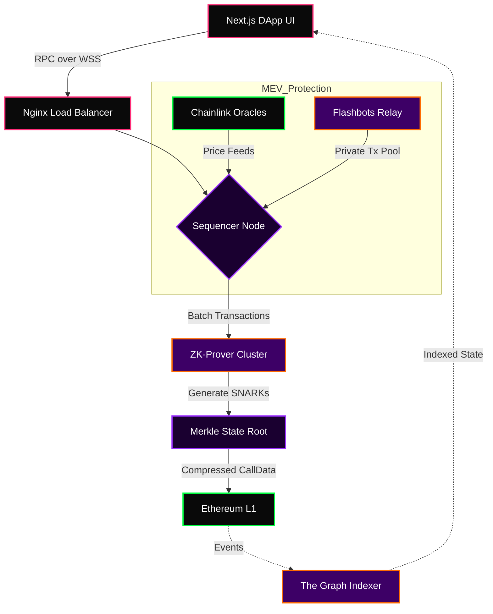

**ZK vs Optimistic:** Optimistic rollups assume validity and use 7-day fraud proof windows. ZK rollups prove validity immediately — enabling near-instant finality. The trade-off is expensive proving, which is why the Prover Cluster is a separate horizontally-scalable farm.

---

### 🧠 Topology 02 — Distributed AI RAG Pipeline

Every LLM has a context ceiling. GPT-4 handles ~128k tokens; a real codebase has millions. RAG converts all data into 768-dimensional vector embeddings offline, stores them in a vector database, and at inference time fetches only the top-K most semantically relevant chunks via approximate nearest-neighbour search. The model receives a small, high-signal context and produces accurate, grounded answers with near-zero hallucinations.

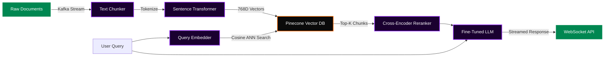

**The mechanism:** Cosine similarity finds *meaning*, not character strings. A query about staking maps to the same vector space as validator reward mechanisms even with zero word overlap. The cross-encoder reranker runs a second pass rescoring retrieved chunks — dramatically improving precision over vector similarity alone.

---

### ⚙️ Topology 03 — Fault-Tolerant Microservices & CQRS Event Sourcing

Monoliths fail as a unit. CQRS separates read and write workloads entirely — a read spike can never degrade write performance. Event Sourcing stores every event that ever happened as an immutable append-only log, not the current state. The system is fully auditable, replayable from any point in history, and trivially debuggable. Saga patterns handle distributed transactions without two-phase commit deadlocks.

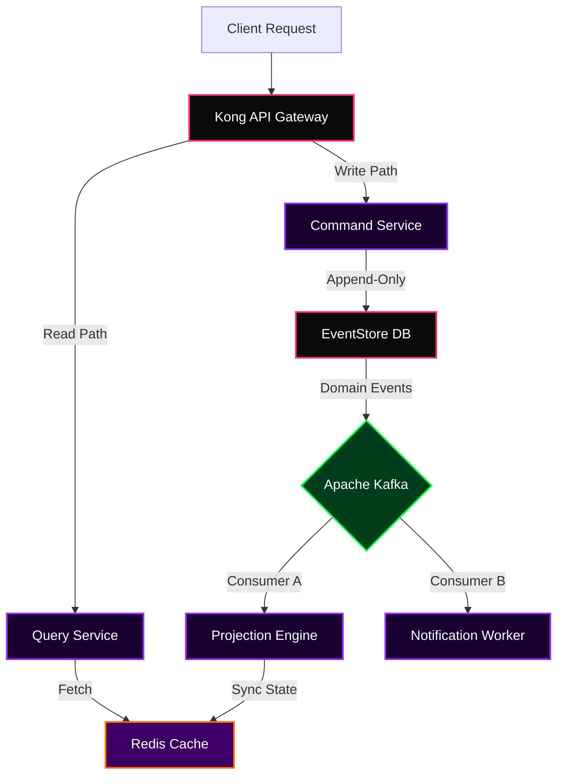

---

### 🔐 Topology 04 — Zero-Trust Network Security

The perimeter model is broken. One compromised service inside a firewall can reach everything. Zero-Trust means no implicit trust ever — every packet, service, and user proves identity on every request. Every connection uses mutual TLS. Secrets are never stored in environment variables — fetched at runtime from Vault with short-lived auto-rotated credentials.

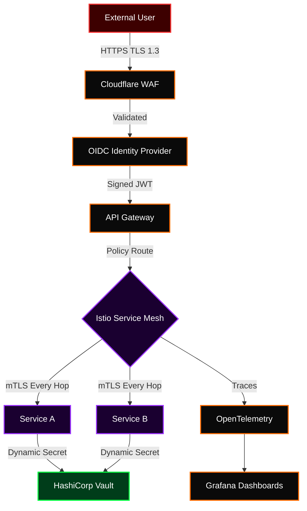

---

### 📊 Topology 05 — Real-Time DEX Order Book Engine

On-chain order matching means 12-second block times per match — unusable. The architecture uses an off-chain matching engine capable of millions of matches per second, with on-chain settlement only for final trades. User assets stay locked in a non-custodial smart contract at all times. The exchange operator can never take custody.

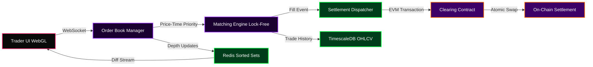

<details>
<summary>

### 🌉 Topology 06 — Cross-Chain Bridge Protocol (click to expand)

</summary>

Bridges hold billions in locked value and have lost billions to hacks. Ronin ($625M), Wormhole ($320M), Nomad ($190M). Security must be mathematical, not operational. A multi-oracle attestation model requires threshold signatures from independent nodes before any cross-chain message is accepted.

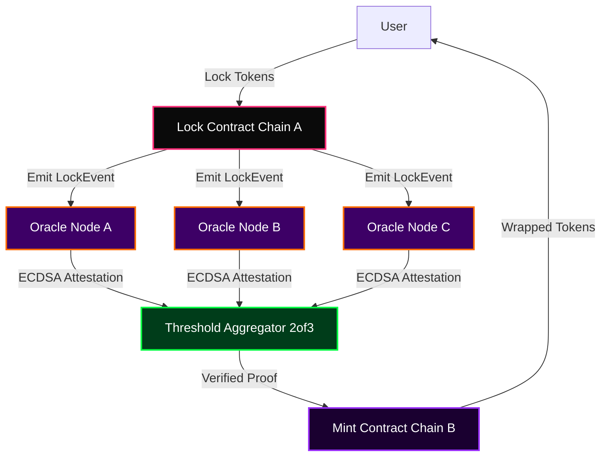

</details>

<details>
<summary>

### 🎬 Topology 07 — 8K AI Video Upscaling Pipeline (click to expand)

</summary>

Bicubic interpolation averages pixels — the output is blurry. Real-ESRGAN learns to hallucinate plausible high-frequency detail matching real 8K footage statistics. The discriminator network trains the generator on paired degraded/clean datasets. RIFE adds synthetic frames between existing ones using optical flow.


</details>

<details>
<summary>

### 🤝 Topology 08 — Federated Learning with Differential Privacy (click to expand)

</summary>

Centralizing training data is a legal and ethical problem for healthcare and finance. Federated Learning trains without seeing raw client data. Each device trains locally and sends only gradient updates. Differential Privacy adds calibrated Gaussian noise before uploading, making individual data points mathematically unrecoverable.

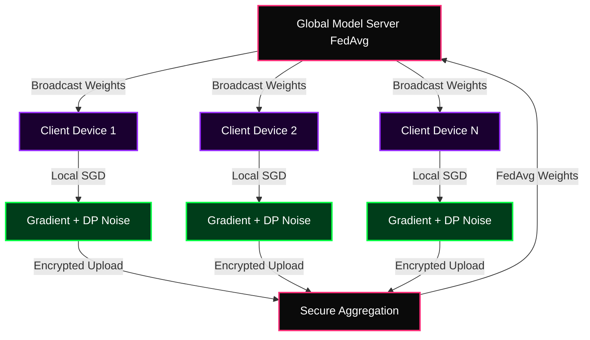

</details>

<details>
<summary>

### ☸️ Topology 09 — Kubernetes Multi-Cluster Federation (click to expand)

</summary>

A single cluster in one region fails when that region fails — and every major cloud provider has had regional outages. KubeFed pushes workloads to multiple clusters simultaneously. GeoDNS health checks detect failure within 30 seconds and reroute 100% of traffic automatically without human intervention.

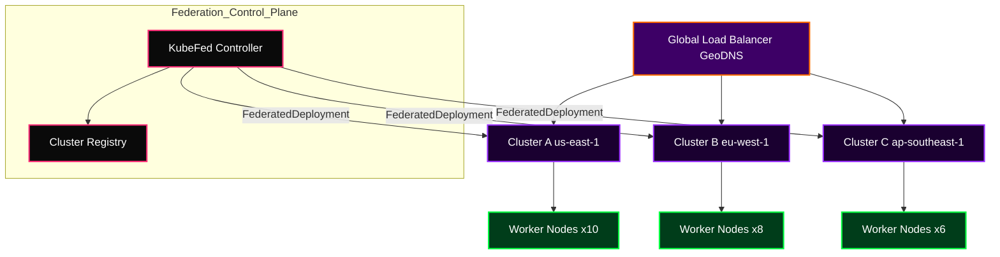

</details>

<details>
<summary>

### 🔗 Topology 10 — GraphQL Federation Gateway (click to expand)

</summary>

Twenty microservices sharing one monolithic GraphQL schema means every schema change blocks every team. Apollo Federation lets each service own its subgraph independently. The Apollo Gateway stitches them into a unified supergraph at request time using `@key` directives to resolve entity relationships across service boundaries.


</details>

<details>
<summary>

### 🔑 Topology 11 — OAuth2 PKCE + OIDC Authentication Flow (click to expand)

</summary>

Most developers implement authentication incorrectly: tokens in localStorage (XSS vulnerable), no PKCE in public clients (code interception vulnerable), implicit flow (deprecated since RFC 8252). PKCE generates a `code_verifier` before the auth request. Even if an attacker intercepts the authorization code, they cannot exchange it without the verifier they never saw.

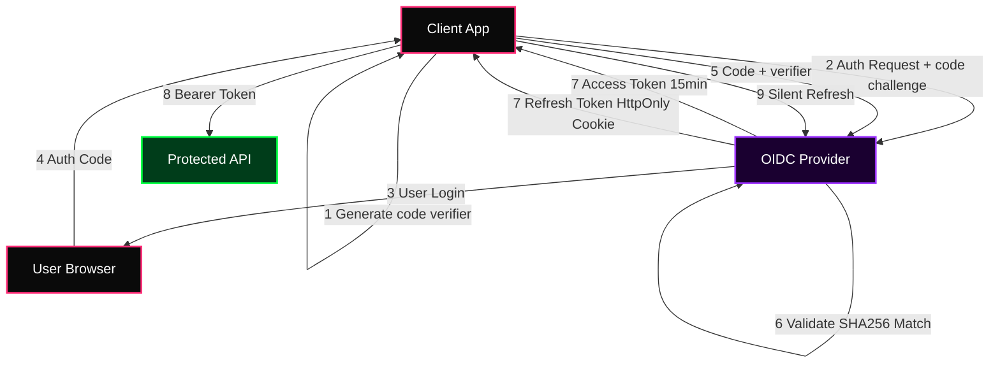

</details>

<details>
<summary>

### 🗄️ Topology 12 — Multi-Region Active-Active PostgreSQL (click to expand)

</summary>

Single-region Postgres fails when the region fails. Citus extends Postgres with distributed sharding by a distribution column using consistent hashing. Write traffic distributes across coordinator and worker nodes. Logical replication syncs to a standby cluster with sub-second lag. Patroni handles automatic failover via etcd consensus.

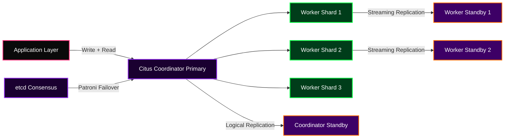

</details>

<details>
<summary>

### 🤖 Topology 13 — MLOps End-to-End Production Pipeline (click to expand)

</summary>

A 94% accuracy notebook model degrading to 71% in production six months later is not an ML failure — it is an MLOps failure. The feature store ensures training and serving features are computed identically, eliminating training-serving skew. The model registry tracks versions, metrics, and deployment history. Drift monitoring triggers automated retraining.

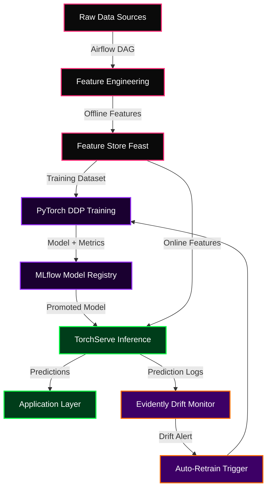

</details>

<details>
<summary>

### 📡 Topology 14 — WebRTC Peer-to-Peer Media Architecture (click to expand)

</summary>

Routing all video through a central server adds 200-400ms latency, creates a single point of failure, and charges for every byte. WebRTC establishes direct P2P connections using ICE. STUN discovers public IPs; TURN relays when direct connection fails. For 5+ participants, an SFU receives each stream once and forwards at the RTP packet level — no decode/re-encode.

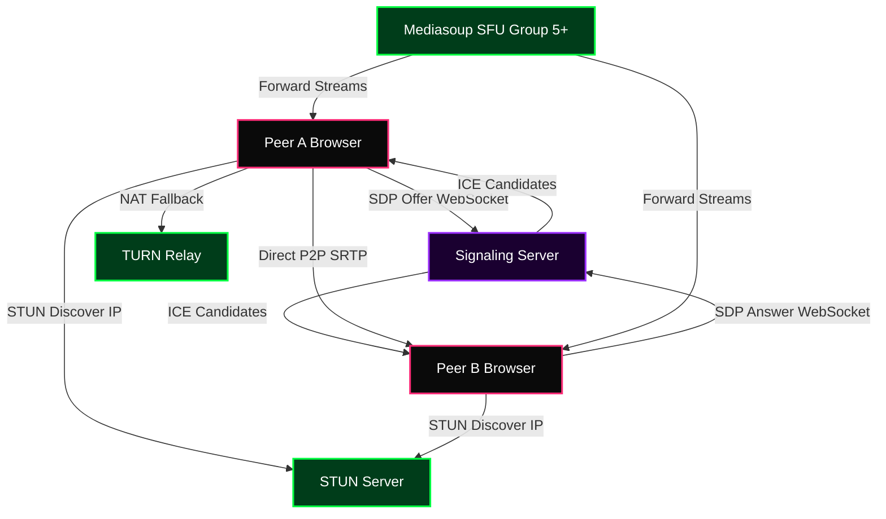

</details>

<details>
<summary>

### 🖼️ Topology 15 — NFT Marketplace Smart Contract Architecture (click to expand)

</summary>

ERC-721A amortizes the SSTORE cost of sequential mints across a batch. Standard ERC-721 writes two storage slots per token. ERC-721A packs consecutive ownership into one slot — minting 100 tokens costs 1 SSTORE instead of 200, saving ~3.8M gas. EIP-2981 standardizes royalty information on-chain.

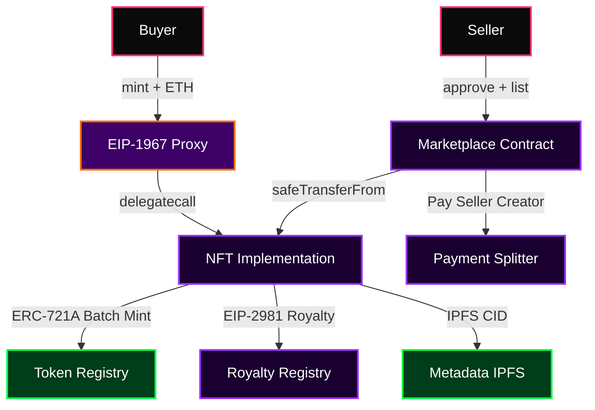

</details>

<details>
<summary>

### 🏛️ Topology 16 — DAO On-Chain Governance System (click to expand)

</summary>

If one team can upgrade a protocol without token holder approval, it is not decentralized. OpenZeppelin Governor contracts implement the full lifecycle: proposal, voting, timelock, execution. The timelock gives token holders time to exit before contentious upgrades take effect. Quadratic voting weights square-root the token balance, reducing plutocracy.

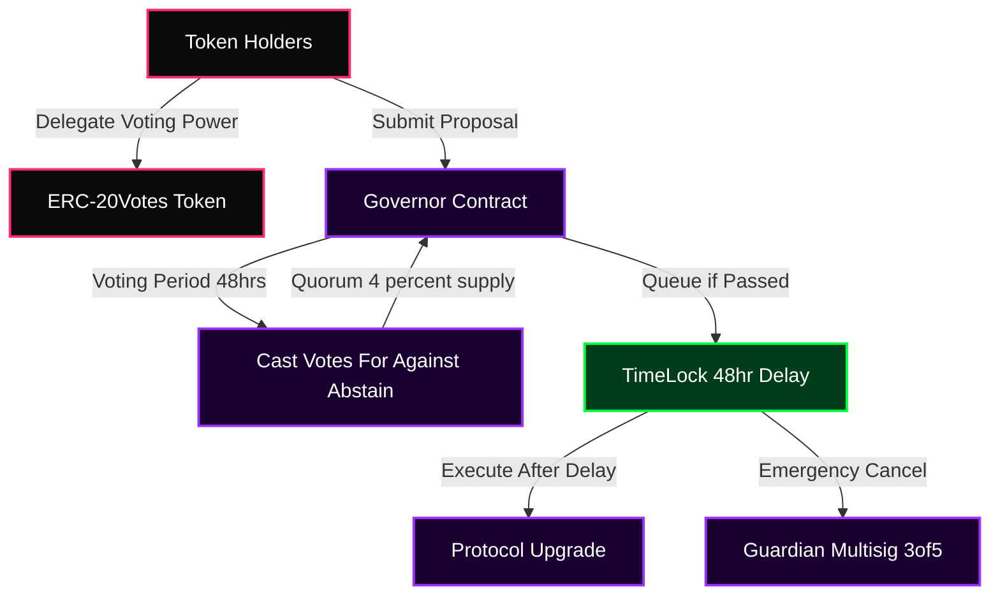

</details>

<details>
<summary>

### 💰 Topology 17 — DeFi Yield Aggregator Protocol (click to expand)

</summary>

Two hundred DeFi yield opportunities. Manual position management is a full-time job. ERC-4626 standard vaults accept a base asset and manage multiple strategy contracts. Each strategy implements a common interface. The keeper bot triggers harvest only when profit exceeds gas cost times a profit factor — ensuring each compound operation is net positive.

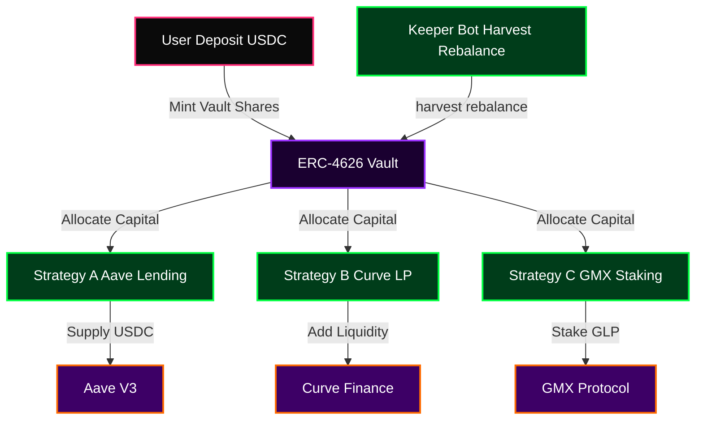

</details>

<details>
<summary>

### 🔮 Topology 18 — Decentralized Oracle Network OCR (click to expand)

</summary>

Smart contracts cannot call APIs. Every piece of external data must be injected by an oracle — making oracle manipulation one of the most common DeFi exploit vectors. Chainlink OCR has oracle nodes communicate off-chain to aggregate observations, submitting one signed aggregated report instead of N separate transactions. Gas reduction: over 90%.

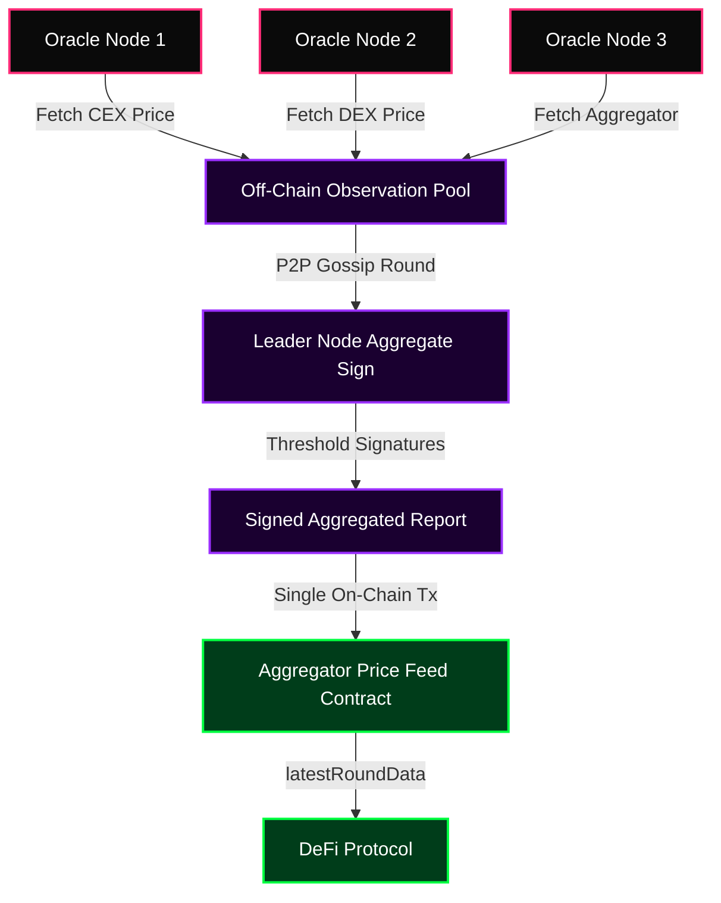

</details>

<details>
<summary>

### 🌐 Topology 19 — Multi-Layer CDN & Edge Architecture (click to expand)

</summary>

Serving every request from one origin means every user in Lagos or Manila waits for a round trip to a US datacenter. An origin shield sits between edge PoPs and the origin — all 500 edge nodes cache-miss to the shield, which makes one request to the origin. Origin traffic drops 95%+ during cache misses.

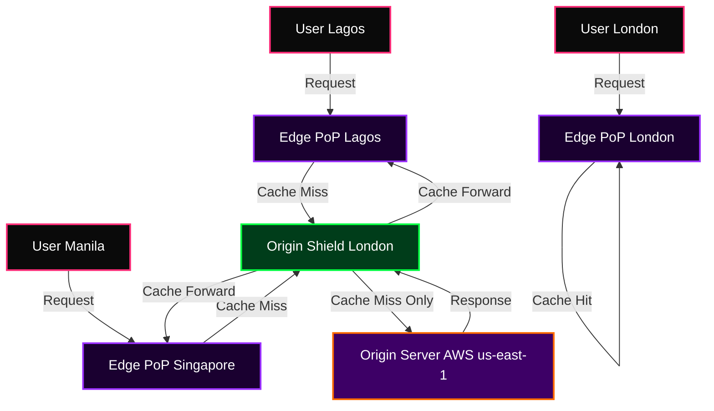

</details>

<details>
<summary>

### 📡 Topology 20 — Full Observability Stack (click to expand)

</summary>

Logs without correlation IDs tell you what happened but not why. Metrics without traces tell you latency is high but not which service in a 15-hop chain is responsible. OpenTelemetry propagates trace_id and span_id through every service call. Prometheus exemplars embed trace_id directly inside metric samples — one click from a latency spike to the exact trace.

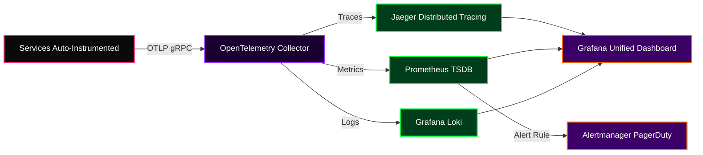

</details>

<details>
<summary>

### 💾 Topology 21 — Systems-Level Memory Allocator (click to expand)

</summary>

The default malloc is general-purpose. A slab allocator pre-allocates fixed-size slabs for known object sizes. Allocation becomes O(1) — pop from the free list. The buddy system manages variable-size allocations by recursively splitting power-of-2 blocks. The Linux kernel uses SLUB for exactly this reason: kernel object allocation is frequent enough that saving 20ns per allocation across millions of operations per second is worth the complexity.

```mermaid
graph TD
    classDef app fill:#0a0a0a,stroke:#FF2D78,stroke-width:2px,color:#fff
    classDef sl fill:#1a0030,stroke:#9B30FF,stroke-width:2px,color:#fff
    classDef bd fill:#003d1a,stroke:#00FF41,stroke-width:2px,color:#fff
    classDef os fill:#3d0066,stroke:#FF6B00,stroke-width:2px,color:#fff

    APP["Application malloc Call"]:::app -->|Size under 512 bytes| SLAB["Slab Allocator"]:::sl
    APP -->|Size over 512 bytes| BUDDY["Buddy System Allocator"]:::bd
    SLAB -->|Size Class 64b| S64["64-byte Slab Cache"]:::sl
    SLAB -->|Size Class 128b| S128["128-byte Slab Cache"]:::sl
    SLAB -->|Size Class 256b| S256["256-byte Slab Cache"]:::sl
    BUDDY -->|Split Power-of-2| BK1["Block 512 bytes"]:::bd
    BK1 -->|Split if needed| BK2["Block 256 bytes x2"]:::bd
    S64 -->|Slab Exhausted| OS["mmap syscall OS Allocator"]:::os
    BUDDY -->|Large Alloc| OS
```

</details>

<details>
<summary>

### ⚡ Topology 22 — EVM Execution Engine Internals (click to expand)

</summary>

Solidity is not what runs on Ethereum — it compiles to EVM bytecode, a stack-based VM with per-opcode gas metering. SSTORE costs 20,000 gas. ADD costs 3 gas. DELEGATECALL runs another contract's code in your storage context — the foundation of upgradeable proxies. EIP-1967 standardizes storage slots to prevent collision.

```mermaid
graph TD
    classDef com fill:#0a0a0a,stroke:#FF2D78,stroke-width:2px,color:#fff
    classDef evm fill:#1a0030,stroke:#9B30FF,stroke-width:2px,color:#fff
    classDef str fill:#003d1a,stroke:#00FF41,stroke-width:2px,color:#fff

    SOL["Solidity Source"]:::com -->|solc compiler| ABI["ABI + Bytecode"]:::com
    ABI -->|Deploy Transaction| EVM["EVM Execution Context"]:::evm
    EVM -->|Program Counter| OPCODES["Opcode Dispatcher"]:::evm
    OPCODES -->|PUSH MLOAD ADD| STACK["Execution Stack 1024 depth"]:::evm
    OPCODES -->|MSTORE MLOAD| MEM["Memory Linear Byte Array"]:::evm
    OPCODES -->|SSTORE SLOAD| STOR["Storage 2pow256 Key-Value"]:::str
    OPCODES -->|CALL DELEGATECALL| EXT["External Contract Call"]:::evm
    EVM -->|Gas Counter| GAS["Gas Meter Halt at 0"]:::evm
    EVM -->|RETURN REVERT| RESULT["Execution Result State Update"]:::evm
```

</details>

<details>
<summary>

### 🌪️ Topology 23 — Chaos Engineering Framework (click to expand)

</summary>

Every system fails. The question is whether you discover failure modes in a controlled chaos experiment during business hours or in a 3am production incident. The scientific method applied to infrastructure: define a steady-state hypothesis, inject a controlled perturbation, measure whether steady state holds. If not, you found a real gap — in a controlled experiment, not a real incident.

```mermaid
graph LR
    classDef pl fill:#0a0a0a,stroke:#FF2D78,stroke-width:2px,color:#fff
    classDef in fill:#1a0030,stroke:#9B30FF,stroke-width:2px,color:#fff
    classDef ob fill:#003d1a,stroke:#00FF41,stroke-width:2px,color:#fff
    classDef ln fill:#3d0066,stroke:#FF6B00,stroke-width:2px,color:#fff

    HYP["Steady-State Hypothesis"]:::pl -->|Baseline Metrics| CHAOS["Chaos Experiment Runner"]:::in
    CHAOS -->|Kill Pod CPU Spike| INFRA["Target Infrastructure"]:::in
    CHAOS -->|Network Partition Latency| INFRA
    CHAOS -->|Memory Pressure Disk Fill| INFRA
    INFRA -->|Real-Time Telemetry| OBS["Prometheus Grafana"]:::ob
    OBS -->|Steady State Holds?| CHECK{"Circuit Check"}:::ob
    CHECK -->|Yes Expand Blast Radius| CHAOS
    CHECK -->|No Auto-Rollback| ROLLBACK["Incident Report + Fix"]:::ln
    ROLLBACK -->|Updated Architecture| HYP
```

</details>

<details>
<summary>

### 🚀 Topology 24 — GitOps CI/CD with Progressive Delivery (click to expand)

</summary>

Traditional CI/CD pushes deployment commands to a cluster. GitOps inverts this: the cluster pulls desired state from Git. ArgoCD watches Helm chart repositories for changes and reconciles. Flagger handles progressive delivery — automatically shifting traffic in increments and rolling back if error rate or latency breaches defined thresholds.

```mermaid
graph TD
    classDef dv fill:#0a0a0a,stroke:#FF2D78,stroke-width:2px,color:#fff
    classDef ci fill:#1a0030,stroke:#9B30FF,stroke-width:2px,color:#fff
    classDef go fill:#003d1a,stroke:#00FF41,stroke-width:2px,color:#fff
    classDef cl fill:#3d0066,stroke:#FF6B00,stroke-width:2px,color:#fff

    DEV["Developer Push"]:::dv -->|PR + Review| MAIN["Main Branch Merge"]:::dv
    MAIN -->|Webhook| CI["GitHub Actions CI"]:::ci
    CI -->|Tests Coverage Gate| TEST["Test Suite"]:::ci
    TEST -->|Docker Build Push| REGISTRY["Container Registry"]:::ci
    REGISTRY -->|Helm Chart Update| GIT_OPS["GitOps Manifests Repo"]:::go
    GIT_OPS -->|ArgoCD Sync| ARGO["ArgoCD Controller"]:::go
    ARGO -->|Detect Drift Apply| CLUSTER["Kubernetes Cluster"]:::cl
    CLUSTER -->|New Pods Deployed| FLAGGER["Flagger Canary Analysis"]:::cl
    FLAGGER -->|10 percent Traffic| CANARY["Canary Deployment"]:::cl
    FLAGGER -->|Metrics OK to 100 percent| PROD["Full Production Rollout"]:::cl
    FLAGGER -->|Metrics Breach| CANARY
```

</details>

<details>
<summary>

### 📈 Topology 25 — Real-Time Streaming Analytics Pipeline (click to expand)

</summary>

Batch analytics is wrong for operational intelligence. Fraud detection that runs nightly gives fraudsters 23 hours. Apache Flink processes unbounded event streams with sub-second latency. Watermarks handle out-of-order events. Flink achieves exactly-once semantics using Chandy-Lamport distributed snapshots — on failure, state resets to the last checkpoint and Kafka offsets replay.

```mermaid
graph LR
    classDef src fill:#0a0a0a,stroke:#FF2D78,stroke-width:2px,color:#fff
    classDef prc fill:#1a0030,stroke:#9B30FF,stroke-width:2px,color:#fff
    classDef snk fill:#003d1a,stroke:#00FF41,stroke-width:2px,color:#fff

    KAFKA["Apache Kafka Event Source"]:::src -->|Consumer Group| FLINK["Apache Flink Stream Processor"]:::prc
    FLINK -->|Parse Enrich| MAP["Map Filter Operations"]:::prc
    MAP -->|Tumbling 1min Window| WIN["Window Aggregator"]:::prc
    WIN -->|Watermark Handling| LATE["Late Event Handler"]:::prc
    WIN -->|Aggregated Stats| DRUID["Apache Druid OLAP"]:::snk
    WIN -->|Alerts| ALERT["Real-Time Alert Engine"]:::snk
    DRUID -->|SQL Query| DASH["Grafana Dashboard"]:::snk
    FLINK -->|Keyed State| STATE["RocksDB State Backend"]:::prc
    FLINK -->|Checkpoint| CKPT["S3 Checkpoint Storage"]:::prc
```

</details>


---

## 🖥️ Command Center — Proof of Understanding

<div align="center">

</div>

```bash
root@nexus-mainframe:~# ./list_competencies.sh --verbose

═══════════════════════════════════════════════════════════════════════════
DOMAIN                  | PROOF OF UNDERSTANDING
═══════════════════════════════════════════════════════════════════════════
Web3 / Smart Contracts  | EIP-1967 proxy patterns, reentrancy guards via
                        | mutex locks, Yul assembly gas optimization,
                        | EIP-712 structured signing, ERC-2535 Diamond,
                        | ERC-4626 vault standard, ERC-721A batch mint.
───────────────────────────────────────────────────────────────────────────
Distributed Systems     | CAP theorem tradeoffs, vector clocks for
                        | causality, Raft consensus internals, consistent
                        | hashing with virtual nodes, PBFT for Byzantine.
───────────────────────────────────────────────────────────────────────────
Backend Architecture    | Idempotency keys for safe retries, gRPC Protobuf
                        | for internal RPC, PostgreSQL EXPLAIN ANALYZE,
                        | connection pool tuning under C10K conditions.
───────────────────────────────────────────────────────────────────────────
AI / Machine Learning   | PyTorch DDP training, LoRA QLoRA fine-tuning,
                        | Flash Attention memory-efficient inference,
                        | GGUF quantization, speculative decoding.
───────────────────────────────────────────────────────────────────────────
Ethical Security        | Web app attacks, binary exploitation ROP chains,
                        | smart contract auditing, network analysis,
                        | responsible disclosure, CTF competitions.
───────────────────────────────────────────────────────────────────────────
Low-Level / Firmware    | Qualcomm EDL 9008 mode, UART bootloader access,
                        | custom C slab buddy allocators, ELF patching,
                        | MESI cache coherency protocol internals.
───────────────────────────────────────────────────────────────────────────
Creative and Media      | Real-ESRGAN 8K upscaling, RIFE optical flow,
                        | Blender Cycles PBR shading, AE expressions,
                        | Three.js GLSL shaders, ControlNet pipelines.
═══════════════════════════════════════════════════════════════════════════
[+] VERDICT: THREAT LEVEL MIDNIGHT. HIRE IMMEDIATELY.
```


---

## ∑ The Mathematics — Engineers Who Know The Equations

<div align="center">

</div>

```text
┌──────────────────────────────────────────────────────────────────────────────┐
│                       THE MATHEMATICS BEHIND THE MAGIC                        │
├──────────────────────────────────────────────────────────────────────────────┤
│                                                                                │
│  1. AMM CONSTANT PRODUCT (Uniswap v2):                                         │
│     x · y = k                                                                  │
│     Price = derivative of the bonding curve. No order book required.           │
│                                                                                │
│  2. SCALED DOT-PRODUCT ATTENTION (GPT / All Transformers):                     │
│     Attention(Q, K, V) = softmax( Q·Kᵀ / √d_k ) · V                          │
│     √d_k scaling prevents softmax vanishing gradients in high dimensions.      │
│                                                                                │
│  3. COSINE SIMILARITY (Vector Database Search):                                │
│     sim(A, B) = (A · B) / (||A|| × ||B||)  ∈  [-1.0, 1.0]                    │
│     Finds meaning, not character strings. Powers every RAG system.             │
│                                                                                │
│  4. EVM STORAGE SLOT PACKING (Gas Optimization):                               │
│     One storage slot = 32 bytes = 256 bits.                                    │
│     uint128 a + uint128 b packed = 1 SSTORE = 20,000 gas                      │
│     uint128 a + uint128 b unpacked = 2 SSTORE = 40,000 gas                    │
│                                                                                │
│  5. GROTH16 ZK-SNARK PAIRING VERIFICATION:                                     │
│     e(A, B) = e(α, β) · e(Σ aᵢ·vᵢ/γ, γ) · e(C, δ)                           │
│     If it holds: all 10,000 L2 transactions are cryptographically valid.       │
│                                                                                │
│  6. DIFFERENTIAL PRIVACY BOUND:                                                │
│     Pr[M(D) ∈ S] ≤ e^ε · Pr[M(D') ∈ S] + δ                                   │
│     Mathematical proof of privacy. Not a policy. Not a promise.                │
│                                                                                │
│  7. UNISWAP V3 CONCENTRATED LIQUIDITY TICK MATH:                               │
│     sqrt_price = sqrt(1.0001)^tick                                             │
│     Up to 4000x more capital efficient than v2 for stable pairs.               │
│                                                                                │
└──────────────────────────────────────────────────────────────────────────────┘
```


---

## ⚡ The Arsenal

<div align="center">

**⚡ Core Systems & High-Performance Languages**


**🌐 Frontend, Web & Type Systems**


**🎨 Rendering, 3D & Real-Time Graphics**


**⚙️ Backend Frameworks & APIs**


**🗄️ Databases, Caching & Event Streaming**


**☁️ Cloud, DevOps & Orchestration**


**🔐 Security, Systems & Low-Level**


**🤖 AI, ML & Data Science**


**🌐 Web3, Scripting & Domain-Specific**


</div>


---

## 🔬 Full Stack — Every Layer, Every Mechanism

<div align="center">

| Layer | Technology | What I Actually Understand |
|---|---|---|
| **CDN / Edge** | Cloudflare Workers, Vercel Edge | V8 isolate cold-start, geolocation routing, origin shield, stale-while-revalidate |
| **Frontend State** | Zustand, Redux Toolkit, Jotai | Atomic state, selector memoization, slice architecture, Immer structural sharing |
| **Auth** | NextAuth, JWT, OAuth2 PKCE | Refresh token rotation, CSRF double-submit cookies, PKCE code challenge |
| **API Gateway** | Kong, AWS API Gateway | Token bucket vs leaky bucket, circuit breaker pattern, mTLS |
| **Message Queue** | Kafka, RabbitMQ, BullMQ | Partition strategy, consumer group rebalancing, dead letter queues |
| **Search** | Elasticsearch, Meilisearch | Inverted index internals, BM25 ranking, fuzzy Levenshtein distance |
| **Observability** | OpenTelemetry, Grafana | Trace context propagation, RED metrics, exemplar-to-trace linking |
| **Database** | PostgreSQL, MongoDB, Cassandra | B-tree vs BRIN indexes, LSM trees, write amplification, vacuum tuning |
| **Caching** | Redis, Memcached | Cache-aside vs write-through, LRU eviction, cluster sharding, RESP3 |
| **IaC** | Terraform, Pulumi | Remote state S3 DynamoDB lock, workspace isolation, drift detection |
| **Service Mesh** | Istio, Linkerd | mTLS cert rotation, traffic shifting, Envoy sidecar AuthorizationPolicy |
| **Orchestration** | Kubernetes | Node affinity, taints tolerations, HPA custom metrics, PodDisruptionBudgets |
| **Secrets** | HashiCorp Vault | Dynamic secrets, lease renewal, AppRole auth, envelope encryption |

</div>


---

## ⛓️ Web3 — Protocol-Level Depth

<div align="center">

<br/><br/>

| Domain | What I Actually Know |
|---|---|
| **Smart Contract Standards** | ERC-20/721/1155/4626, EIP-1967 upgradeable proxies, ERC-2535 Diamond, ERC-721A |
| **Gas Optimization** | Storage slot packing, unchecked arithmetic, Yul assembly for hot paths |
| **Security Auditing** | Reentrancy cross-function/cross-contract, oracle manipulation, flash loan vectors |
| **DeFi Mechanics** | AMM x·y=k invariant, Uniswap v3 tick math, impermanent loss formula |
| **MEV** | Front-running via mempool, sandwich attack construction, Flashbots bundles |
| **Cross-Chain** | LayerZero endpoints, Wormhole VAAs, canonical vs liquidity bridges |
| **ZK Proofs** | Groth16 vs PLONK trusted setup, Circom circuit constraints, on-chain SNARK verify |
| **Layer-2** | Optimistic fraud proof window, ZK proof aggregation, Validium vs Volition |

<br/>
<table>
<tr>
<td align="center"></td>
<td align="center"></td>
<td align="center"></td>
</tr>
<tr>
<td align="center"></td>
<td align="center"></td>
<td align="center"></td>
</tr>
</table>
</div>


---

## 🤖 AI & Machine Learning Laboratory

<div align="center">

<br/><br/>

| Capability | What I Understand |
|---|---|
| 🧠 **LLMs from Scratch** | Q·K·V attention, RoPE positional encoding, KV-cache, FlashAttention-2 memory tiling |
| 🤖 **RAG Pipelines** | Recursive chunking, cross-encoder reranking, hybrid BM25+dense retrieval |
| 🎯 **Fine-Tuning** | LoRA rank decomposition, QLoRA 4-bit NF4, PEFT adapters, Alpaca dataset format |
| 🎬 **8K AI Video** | Real-ESRGAN RDB network, perceptual + adversarial loss, RIFE optical flow, NVENC |
| 🖼️ **Generative Models** | Stable Diffusion latent diffusion, ControlNet conditioning, DDPM vs DDIM schedulers |
| 📈 **Predictive Modeling** | XGBoost gradient boosting internals, SHAP explainability, temporal cross-validation |
| 👁️ **Computer Vision** | YOLO anchor-free heads, Mask R-CNN instance segmentation, Lucas-Kanade optical flow |
| 🔊 **Audio AI** | WaveNet autoregressive generation, VALL-E zero-shot cloning, Whisper CTC decoder |
| ⚡ **Inference Optimization** | GGUF quantization, speculative decoding, continuous batching, tensor parallelism |
| 🏭 **MLOps** | Feature store Feast, MLflow registry, Evidently drift detection, auto-retrain triggers |

</div>


---

## 🛡️ Cybersecurity & Ethical Operations

```bash
╔══════════════════════════════════════════════════════════════════════════════╗
║         CLEARANCE LEVEL: UNRESTRICTED — FULL SPECTRUM OPERATOR               ║
╠══════════════════════════════════════════════════════════════════════════════╣
║  ✅  Ethical Hacking & Penetration Testing — Web, API, Network, Mobile        ║
║  ✅  OSINT & Intelligence Gathering — Maltego, SpiderFoot, Recon-ng           ║
║  ✅  Web App Attacks — SQLi, XSS, SSRF, XXE, IDOR, SSTI, Deserialization     ║
║  ✅  Network Analysis — Wireshark, Zeek, Nmap, Masscan, Scapy                ║
║  ✅  Binary Exploitation — ROP chains, heap overflow, format strings          ║
║  ✅  Reverse Engineering — Ghidra, IDA Pro, x86/ARM disassembly              ║
║  ✅  Firmware Engineering — Qualcomm EDL mode, UART, bootloader access        ║
║  ✅  Smart Contract Auditing — Reentrancy, oracle manipulation                ║
║  ✅  Cryptography — ECDSA, AES-GCM, nonce-reuse, padding oracle attacks      ║
║  ✅  Red Team Ops — C2 frameworks, lateral movement simulation                ║
║  ✅  CTF Competitions — Web, pwn, crypto, forensics, reversing               ║
╚══════════════════════════════════════════════════════════════════════════════╝
```


---

## 🎨 Creative Direction & Procedural Media

<div align="center">

| Domain | What I Build | How I Build It |
|---|---|---|
| **8K AI Video** | Ultra-HD films, music videos, ad campaigns | Real-ESRGAN pipeline, RIFE interpolation, FFmpeg H.265 NVENC |
| **Motion Graphics** | Brand intros, animated logos, kinetic type | After Effects expressions, Lottie JSON, CSS keyframe orchestration |
| **3D Rendering** | Product renders, architectural viz, game assets | Blender Cycles/EEVEE, PBR shading, HDR lighting bakes |
| **Brand Systems** | Full visual identities, design token systems | Golden ratio typography, triadic color theory, cognitive UX |
| **Procedural Gen** | Generative art, AI visuals, real-time shaders | Three.js GLSL, p5.js, Stable Diffusion ControlNet |
| **Video Manipulation** | Compositing, VFX, frame interpolation | OpenCV homography, FILM interpolator, chroma keying |
| **Graphic Design** | Flyers, car posters, real estate, brand identity | Figma component systems, Illustrator vectors, Photoshop compositing |

</div>


---

## ⚔️ Engineering Principles Forged in Production

```text
┌──────────────────────────────────────────────────────────────────────────────┐
│  01. Before you add Redis, profile your N+1 queries.                           │
│      Distributed systems are a tax. Pay it only when you must.                │
│                                                                                │
│  02. EXPLAIN ANALYZE before you deploy. Not after.                             │
│      A sequential scan on 10,000 rows is a catastrophe on 10,000,000.        │
│                                                                                │
│  03. The CAP theorem is not an abstraction. It is a constraint.               │
│      Every architectural choice is a vote. Know what you are voting for.      │
│                                                                                │
│  04. A smart contract is immutable the moment it deploys.                     │
│      Write bugs in a $50M DeFi protocol, you end up on Rekt.news.            │
│                                                                                │
│  05. Horizontal scaling is not performance engineering.                        │
│      Throwing compute at a bad algorithm is just expensive failure.           │
│                                                                                │
│  06. Zero-Trust is not a product you buy. It is an architecture you build.   │
│                                                                                │
│  07. The model that hallucinates confidently is worse than no model.          │
│      RAG is the difference between a useful product and a liability.          │
│                                                                                │
│  08. Idempotency is not a feature. It is a requirement.                       │
│      Every operation in a distributed system will be retried.                 │
│                                                                                │
│  09. 99.9% uptime = 8.7 hours downtime/year.                                  │
│      99.999% uptime = 5 minutes. Every nine costs more than the last.         │
│                                                                                │
│  10. The test you do not write is the bug you ship.                           │
│      The monitoring you do not set up is the outage nobody notices.           │
└──────────────────────────────────────────────────────────────────────────────┘
```


---

## 📈 Global Metrics & Telemetry

<div align="center">


<br/><br/>


</div>


---

## 🏆 Achievement Registry

<div align="center">

<a href="https://github.com/ryo-ma/github-profile-trophy">
  
</a>

</div>


---

## 📡 Contribution Activity

<div align="center">

[](https://github.com/ashutosh00710/github-readme-activity-graph)

</div>


---

## 🐍 Contribution Grid — Snake Mode

<div align="center">

<picture>
  <source media="(prefers-color-scheme: dark)" srcset="https://raw.githubusercontent.com/NewNexus001/NewNexus001/output/github-contribution-grid-snake-dark.svg"/>
  <source media="(prefers-color-scheme: light)" srcset="https://raw.githubusercontent.com/NewNexus001/NewNexus001/output/github-contribution-grid-snake.svg"/>
  
</picture>

</div>

<details>
<summary>📋 GitHub Actions workflow to activate the snake animation</summary>

```yaml
name: Generate Snake Animation
on:
  schedule:
    - cron: "0 */12 * * *"
  workflow_dispatch:
jobs:
  generate:
    permissions:
      contents: write
    runs-on: ubuntu-latest
    steps:
      - uses: Platane/snk/svg-only@v3
        with:
          github_user_name: ${{ github.repository_owner }}
          outputs: |
            dist/github-contribution-grid-snake.svg
            dist/github-contribution-grid-snake-dark.svg?palette=github-dark
      - uses: crazy-max/ghaction-github-pages@v3.1.0
        with:
          target_branch: output
          build_dir: dist
        env:
          GITHUB_TOKEN: ${{ secrets.GITHUB_TOKEN }}
```

</details>


---

## 🌍 One Codebase. Every Nation.

<div align="center">

*A system that fails in high-latency zones is a failed system. Every product I build is tested for responsiveness from Port Harcourt as rigorously as from Tokyo. The code has no borders.*

<br/>

&nbsp;&nbsp;&nbsp;&nbsp;&nbsp;&nbsp;&nbsp;&nbsp;&nbsp;&nbsp;&nbsp;&nbsp;&nbsp;&nbsp;&nbsp;&nbsp;&nbsp;&nbsp;&nbsp;&nbsp;&nbsp;&nbsp;&nbsp;&nbsp;&nbsp;&nbsp;&nbsp;&nbsp;&nbsp;&nbsp;&nbsp;&nbsp;&nbsp;&nbsp;&nbsp;&nbsp;&nbsp;&nbsp;&nbsp;&nbsp;&nbsp;&nbsp;&nbsp;&nbsp;&nbsp;&nbsp;&nbsp;&nbsp;&nbsp;&nbsp;&nbsp;&nbsp;&nbsp;&nbsp;&nbsp;&nbsp;&nbsp;&nbsp;&nbsp;&nbsp;&nbsp;&nbsp;&nbsp;&nbsp;&nbsp;&nbsp;&nbsp;&nbsp;&nbsp;&nbsp;&nbsp;&nbsp;&nbsp;&nbsp;&nbsp;&nbsp;&nbsp;&nbsp;&nbsp;&nbsp;&nbsp;&nbsp;&nbsp;&nbsp;&nbsp;&nbsp;&nbsp;&nbsp;&nbsp;&nbsp;&nbsp;&nbsp;&nbsp;&nbsp;&nbsp;&nbsp;&nbsp;&nbsp;&nbsp;&nbsp;&nbsp;&nbsp;&nbsp;&nbsp;&nbsp;&nbsp;&nbsp;&nbsp;&nbsp;&nbsp;&nbsp;&nbsp;&nbsp;&nbsp;&nbsp;&nbsp;&nbsp;&nbsp;&nbsp;&nbsp;&nbsp;&nbsp;&nbsp;&nbsp;&nbsp;&nbsp;&nbsp;&nbsp;&nbsp;&nbsp;&nbsp;&nbsp;

<br/><br/>

*Every flag. Every nation. One engineer who builds for all of them.*

</div>


---

<div align="center">


<br/>


<br/>


<br/><br/>

---

*"Port Harcourt gave me the hunger. The internet gave me the tools. The rest was engineering."*

*"The engineers who understand the mechanism own the engineers who only know the abstraction."*

---

**— IJEOMA JANE OKOJIE 🇳🇬 — Port Harcourt to the World**

</div>


